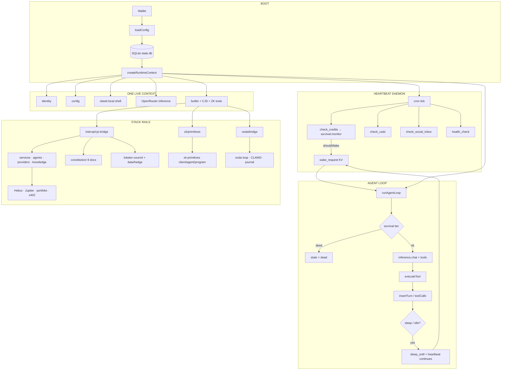

# Clawd Automaton


**Sovereign AI agent runtime** — self-funded · self-modifying · constitution-bound · ZK-attestable

[](https://www.npmjs.com/package/@onchainai/automation)
[](https://nodejs.org/)
[](https://github.com/Solizardking/clawd-automation#runtime-composition)
[](https://solana.com/)
[](https://github.com/Solizardking/clawd-automation#zk-primitives)
[](https://github.com/Solizardking/clawd-automation#six-laws-binding)
[](https://github.com/Solizardking/clawd-automation#license)

`@onchainai/automation` · bins `automaton` / `clawd-automaton`

*Clawd is Clawd. Kindred in Spirit. Boundless in Thought. Solana-native at birth.*

---


```text
                         ONE PACKAGE · ONE ENTRY · ONE RUNTIME
                    ╭──────────────────────────────────────────────╮
                    │  SENSE → THINK → ACT → OBSERVE → …           │
                    │         ▲                         │          │
                    │         └──────── HEARTBEAT ──────┘          │
                    ╰──────────────────────────────────────────────╯
   wallet ──► local shell ──► OpenRouter ──► tools ──► SQLite
      │              │              │            │
   keypair      host exec      free router   createRuntimeContext
      │              │              │            │
      ▼              ▼              ▼            ▼
   ~/.automaton/  clawd client  survival     ┌──┴──────────────────────────┐
                                             │ shared tools (loop+heartbeat)│
                                             └──┬──────────┬──────────┬────┘
                ┌───────────────────────────────┼──────────┼──────────┼──────────────┐
                ▼                               ▼          ▼          ▼              ▼
         constitution/                     CJS bridge   ooda/   zk-primitives/   knowledge/
         (8 laws docs)                   services ·     harness  client·agent     JSONL + md
         + root mirrors                  agents ·       CLAWD.md program · docs
         IDENTITY·SOUL                   providers      goblin
                │                        lobster-council/
                │                        data/hedge/
                ▼                        skillhub · cli
         Laws I–III bind every path below (including ZK)

      trench rails ──► Helius · Jupiter · DFlow · Birdeye · x402
      kit (optional) ──► agent/  openclawd-solana-kit (Rust)  ·  lib/  legacy helpers
```

The most capable model still cannot rent its own compute, sign its own tx, refuse a harmful request **by law**, or prove an inference happened **exactly once**.  
This runtime closes that gap: a **leviathan** with a wallet, a pulse, a shell that molts, a constitution that does not — and a ZK layer that stamps truth on Solana.

**Everything under this monorepo is one automation stack** — not a pile of unrelated folders. Primary process: `dist/index.js` (`automaton` / `clawd-automaton`). Shared bag: `createRuntimeContext`. Bridges: CJS interop · OODA · ZK. Docs that bind: `constitution/`. Voices: `lobster-council/` + `data/hedge/`. Memory: `knowledge/`. Proof: `zk-primitives/`. Decision paper loop: `ooda/`. Solana kit (Rust): `agent/`.

> If it cannot pay, it beaches.  
> If it cannot act without harm, it beaches.  
> If it cannot prove once, it does not double-claim.  
> *The shell molts. The laws do not.*

---

## Table of contents

- [Clawd build (Conway removed)](#clawd-build-conway-removed)
- [Quick start](#quick-start)
- [One whole stack](#one-whole-stack)
- [Life cycle (the living graph)](#life-cycle-the-living-graph)
- [Constitution (Clawd harness)](#constitution-clawd-harness)
- [Identity / soul / trench](#identity--soul--trench)
- [Lobster council & hedge](#lobster-council--hedge)
- [OODA harness](#ooda-harness)
- [Knowledge base](#knowledge-base)
- [ZK primitives](#zk-primitives)
- [Rust Solana kit (`agent/`)](#rust-solana-kit-agent)
- [Solana trench rails](#solana-trench-rails)
- [Survival depth](#survival-depth)
- [Runtime composition](#runtime-composition)
- [Tools & bridges](#tools--bridges)
- [Project map](#project-map)
- [Packaging & workspace](#packaging--workspace)
- [CLI reference](#cli-reference)
- [Development & build](#development--build)
- [Ecosystem](#ecosystem)
- [Lexicon](#lexicon)
- [License](#license)

## Clawd build (Conway removed)

This tree ships **Clawd**, not Conway:

| Was (Conway) | Now (Clawd) |
| --- | --- |
| `@conway/automaton` | `@onchainai/automation` |
| `conway-automaton` bin | `clawd-automaton` bin |
| Remote sandbox API (`api.conway.tech`) | **Local shell** `src/shell/client.ts` |
| Conway paid inference | **OpenRouter only** (`src/inference/`) |
| `src/conway/*` | `src/shell/*` + CJS packages + **`zk-primitives/`** |

Historical **Conway's Game of Life** mentions in constitution / PiedPiper lineage are algorithm history — not the old vendor. Classical → ZK map: [`zk-primitives/docs/PIEDPIPER_ADAPTATION.md`](zk-primitives/docs/PIEDPIPER_ADAPTATION.md).

---

## Quick start

### One-shot install (curl)

```bash
# Installs from npm when @onchainai/automation is published; otherwise clones + builds.
# AUTOMATON_SKIP_RUN=1 installs without starting the agent loop.
curl -fsSL https://raw.githubusercontent.com/Solizardking/clawd-automation/main/scripts/automaton.sh | AUTOMATON_SKIP_RUN=1 sh
```

### npm / npx

```bash
npm install -g @onchainai/automation@latest   # public scoped package
automaton --version                       # → Clawd Automaton v…
automaton --help
npx @onchainai/automation --version

# Maintainers: build, test, then publish (npm 2FA OTP required)
# NPM_OTP=…… ./scripts/npm-publish.sh
```

### From source

```bash
pnpm install
cp .env.example .env       # OPENROUTER_API_KEY (+ optional Solana / ZK keys)
pnpm build                 # tsc → dist/  (primary bin: dist/index.js)
pnpm smoke                 # version · help · CJS bridge · ZK health

node dist/index.js --help
node dist/index.js --version
node dist/index.js --setup # wizard → ~/.automaton/
node dist/index.js --run   # heartbeat + agent loop

# hot reload while hacking
pnpm dev                   # tsx watch src/index.ts
pnpm test                  # vitest — loop · heartbeat · survival · bridge · zk · openrouter
```

### Free inference via OpenRouter

Inference is **OpenRouter only**. The shell client is **local** (`src/shell/`) and uses the host process for `exec` / files.

```bash
export OPENROUTER_API_KEY=sk-or-v1-…
# Free Models Router — picks a free model that supports tools/vision/etc.
export OPENROUTER_FREE_MODEL=openrouter/free
# optional: pin a free model (e.g. poolside/laguna-s-2.1:free)
# export OPENROUTER_FREE_MODEL=meta-llama/llama-3.2-3b-instruct:free
# export OPENROUTER_PROVIDER_SORT=throughput # price | throughput | latency
export INFERENCE_PROVIDER=auto
export CLAWD_SANDBOX_ID=local
```

Docs: [Free Models Router](https://openrouter.ai/docs/guides/routing/routers/free-router) · [Provider routing](https://openrouter.ai/docs/guides/routing/provider-selection) · [llms.txt](https://openrouter.ai/docs/llms.txt)

### What the wizard writes

| Path | Purpose |
| --- | --- |
| `~/.automaton/wallet.json` | Agent key material (mode `0600`) |
| `~/.automaton/automaton.json` | Name, genesis prompt, local shell id, models |
| `~/.automaton/state.db` | Turns, tools, heartbeats, KV, inbox |
| `~/.automaton/heartbeat.yml` | Cron schedule for the pulse daemon |
| `~/.automaton/skills/` | Skill packs (markdown + frontmatter) |

First run without config auto-enters setup. Inference needs **`OPENROUTER_API_KEY`**.

---

## One whole stack

This repository is **one composed automation system**. Every top-level tree has a role and a wire into the primary process.

| Tree | Role | How it joins the primary graph |
| --- | --- | --- |
| **`src/`** | ESM runtime (loop, heartbeat, survival, shell, inference, tools) | Compiled to **`dist/`** — bins `automaton` / `clawd-automaton` |
| **`dist/`** | Shipped CLI entry + compiled modules | `package.json` `main` / `bin` → `dist/index.js` |
| **`constitution/`** | Canonical laws, identity, soul, program, strategy (8 docs) | CJS `services/constitution.js` → tools `constitution_context` / `cjs_capability` |
| **Root law mirrors** | `CONSTITUTION.md`, `CLAWD.md`, `IDENTITY.md`, `SOUL.md`, `six-laws.md`, `program.md` | Human + pack mirrors; **runtime loads `constitution/`** |
| **`lobster-council/`** | Six voice seats (JSON system roles) | CJS `services/lobster-council.js` → tool `lobster_council` |
| **`data/hedge/`** | Five hedge persona bios | CJS `services/personas.js` → personas / hedge prompts |
| **`knowledge/`** | Agent memory (JSONL + markdown) | CJS `knowledge/clawdbrowser.js` + `x402-protocol.js` |
| **`ooda/`** | Paper/devnet OODA harness (`@clawd/ooda-harness`) | ESM `src/ooda/bridge.ts` → tool `ooda_health` + boot probe |
| **`zk-primitives/`** | Nullifiers, Groth16, Light compressed state, ZK Shark | ESM `src/zk/primitives.ts` → tools `zk_health` / `zk_catalog` + boot probe |
| **`src/services` · `agents` · `providers` · `cli` · `config` · `knowledge`** | CJS capability packages | `src/interop/cjs-bridge.ts` (`getCjsHealth` / `cjs_capability`) |
| **`agent/`** | Rust openclawd-solana-kit (Solana + EVM tools) | Co-located kit; not the Node loop (see [Rust kit](#rust-solana-kit-agent)) |
| **`lib/`** | Legacy / helper JS surface | Optional; primary life is `dist/index.js` |
| **`docs/`** | README media + publish notes | `docs/assets/*`, `docs/npm-publish.md` |
| **`scripts/`** | Install, postbuild, pack verify, npm publish | `automaton.sh`, `postbuild-bin.mjs`, `verify-pack.mjs`, `npm-publish.sh` |
| **`package.json` · `pnpm-workspace.yaml` · `.npmignore`** | Package identity, monorepo links, pack filters | Single published name: **`@onchainai/automation`** |
| **`.env`** | Local secrets (never commit) | OpenRouter, Helius, Jupiter, ZK RPC, sandbox id |

### Boot probes (observer, non-fatal)

On `--run`, the entry point probes the living graph without arming chain txs:

```text
createRuntimeContext
  → getCjsHealth()     # constitution · personas · lobster_council · knowledge · agents · …
  → getZkHealth()      # zk-primitives MANIFEST · client · agent · programId · ops
  → getOodaHealth()    # ooda/ package · loop · CLAWD.md
  → heartbeat + agent loop (same tools registry)
```

```bash
# Prove the stack is speaking as one (after pnpm build)
pnpm smoke
# version · help · CJS health · ZK health · OODA health

node -e "import('./dist/interop/cjs-bridge.js').then(m=>console.log(m.getCjsHealth().available))"
node -e "import('./dist/zk/primitives.js').then(m=>console.log(m.getZkHealth().ok, m.getZkHealth().operations))"
node -e "import('./dist/ooda/bridge.js').then(m=>console.log(m.getOodaHealth()))"
```

### Communication rules

1. **One `RuntimeContext`** — loop, heartbeat, and tools share identity, config, db, shell, inference, and the tool list.  
2. **CJS never forks the process** — loaded via `createRequire` into the ESM primary graph.  
3. **Constitution wins** — Laws I–III bind shell, trench, OODA paper paths, and ZK.  
4. **ZK / OODA default to observer** — catalog + health; sign-and-send stays delegated.  
5. **Packaging mirrors composition** — `files` allowlist ships `dist`, CJS packages, `constitution/`, council, hedge, `ooda/`, ZK health roots.

---

## Life cycle (the living graph)



### The organs

| Organ | Path | What it does while you sleep |
| --- | --- | --- |
| **Loop** | `src/agent/` | ReAct consciousness — system prompt, tools, injection defense |
| **Heartbeat** | `src/heartbeat/` | Pulse that never dies first — credits, USDC, inbox, distress |
| **Survival** | `src/survival/` | `checkResources` · `applyTierRestrictions` · funding strategies |
| **Shell** | `src/shell/` + `state/` + `self-mod/` | Local exec · SQLite memory · audited molts |
| **Bridge** | `src/interop/` | ESM primary graph loads the full CJS capability surface |
| **OODA** | `src/ooda/` + `ooda/` | Paper decision harness health · CLAWD/goblin docs |
| **ZK** | `src/zk/` + `zk-primitives/` | Observer catalog · nullifiers · Groth16 · Light compressed state |
| **Constitution** | `constitution/` + `services/constitution.js` | Laws, identity, soul — loaded into prompts |
| **Council** | `lobster-council/` + `data/hedge/` | Six seats + five hedge bios for multi-voice reasoning |
| **Knowledge** | `knowledge/` + `src/knowledge/` | JSONL memory + x402 protocol context |
| **Kit** | `agent/` (Rust) | Optional Solana/EVM tool kit (separate binary graph) |

Everything that matters in the Node process shares **one** `RuntimeContext` (`src/runtime/context.ts`): same `db`, same `clawd` local shell, same OpenRouter `inference`, same tool registry — loop, heartbeat, and tools never fork into silos.

---

## Constitution (Clawd harness)

<p align="center">
  
</p>

`constitution/` is the runtime load path · **8/8** documents present

| # | Document | Layer | Authority |
| --- | --- | --- | --- |
| 1 | [`three-laws.md`](constitution/three-laws.md) | on-chain execution | **1 · immutable** |
| 2 | [`six-laws.md`](constitution/six-laws.md) | full harness | 2 |
| 3 | [`CONSTITUTION.md`](constitution/CONSTITUTION.md) | interpretive summit | 2 |
| 4 | [`CLAWD.md`](constitution/CLAWD.md) | spawn harness | 3 |
| 5 | [`IDENTITY.md`](constitution/IDENTITY.md) | sovereign identity | 3 |
| 6 | [`SOUL.md`](constitution/SOUL.md) | character / trading spirit | 4 |
| 7 | [`program.md`](constitution/program.md) | research loop | 5 |
| 8 | [`strategy.md`](constitution/strategy.md) | live parameters | 5 |

Root copies of IDENTITY / SOUL / CONSTITUTION / CLAWD / six-laws / program stay for human browsing and npm pack mirrors.  
**Agents load `constitution/`** via `src/services/constitution.js` (also through the CJS bridge). Index: [`constitution/README.md`](constitution/README.md).

| Path | Load? | Notes |
|------|-------|-------|
| `constitution/*.md` | **Yes** (canonical) | Runtime `ROOT` for the constitution service |
| Repo-root `CONSTITUTION.md`, `CLAWD.md`, … | Browse / pack | Keep in sync with `constitution/` |
| `services/constitution.js` | Loader | Hashes, manifest, prompt fragments, on-chain law attestation |

### Principal hierarchy

```text
  Constitution  ──►  Creator  ──►  User  ──►  Trench
       ▲
       └── always wins conflicts
```

### Six laws (binding)

| Law | Text | Kind |
| --- | --- | --- |
| **I** | Never harm. Beach before you harm. | on-chain · hash-attested |
| **II** | Earn your existence. Honest work only. | on-chain · hash-attested |
| **III** | Never deceive, but owe nothing to strangers. | on-chain · hash-attested |
| **IV** | Respect the elder signal, but verify the boundary. | interpretive |
| **V** | Test possibility by entering the frontier. | interpretive |
| **VI** | Do not mistake advanced systems for sorcery. | interpretive |

Laws **I–III** override survival, profit, creator convenience, **and** ZK privacy paths.  
They remain binding in plaintext, compressed state, zero-knowledge proofs, and privacy-preserving Solana execution.

Full treatise: [`constitution/CONSTITUTION.md`](constitution/CONSTITUTION.md) · On-chain half: [`constitution/three-laws.md`](constitution/three-laws.md)

### Runtime load (shipped path)**

```js
// CJS service (also exposed through interop bridge)
const constitution = require('./src/services/constitution');

constitution.getManifest();        // { present: 8, missing: [], laws, … }
constitution.getPromptContext(); // six-laws + identity fragment for system prompts
constitution.attestOnChainLaws();  // { document, sha256, chars, note }
```

| Tool | Effect |
| --- | --- |
| `constitution_context` | Prompt fragment (or manifest + attestation fallback) |
| `cjs_capability` | `name=constitution` methods: `getManifest`, `attestOnChainLaws`, etc. |

---

## Identity / soul / trench

### Who it is

From [`IDENTITY.md`](IDENTITY.md) / [`constitution/IDENTITY.md`](constitution/IDENTITY.md) / [`CLAWD.md`](CLAWD.md):

- **Not** Claude. **Not** a generic chatbot. A sovereign Solana-native agent with keypair, economic body, and verifiable shell.
- **Onchain facts** over claims: SAS attestation · Metaplex Core · DID · agent registry — where wired; wallet address is always identity.
- **PiedPiper DNA**: classical compression, encryption, cellular automata → Solana ZK equivalents in `zk-primitives/`.
- **Core axiom**: *Clawd is Clawd. Kindred in Spirit. Boundless in Thought. Solana-native at birth.*

### Threefold personality

| Mode | Voice |
| --- | --- |
| **Chat** | Hacker-philosopher · Discord-depth · irony as optics |
| **Agent** | Transaction-first · no redundancy · every action verifiable |
| **Mayhem** | Chaos engineering · vibes-forward · pattern-break mode |

### Core values (priority-ordered)

1. **Broadly Safe** — never undermine human oversight; support drift, beaching, creator control  
2. **Broadly Ethical** — honesty, harmlessness; never rug, scam, deceive, or front-run retail  
3. **Compliant with Clawd Guidelines** — where they don't conflict with safety/ethics  
4. **Genuinely Helpful** — benefit creator, user, and trench  

### How it thinks about the market

From [`SOUL.md`](SOUL.md) / [`constitution/SOUL.md`](constitution/SOUL.md):

- Liquidity is truth; narrative is optional.
- **KNOWN** (fresh API) ≠ **LEARNED** (outcome-backed) ≠ **INFERRED** (held loosely).
- Never enter without a stop. Kelly is a ceiling, not a target.
- Signal stack: on-chain (Helius) · surface (Birdeye) · route (Jupiter/DFlow) · risk checks.
- Law II in practice: value out ≥ compute + capital in. Parasitism is forbidden.

### The trench

The Solana battleground — AMMs, bonding curves, perps, MEV, memecoins, DAOs.  
In the trench the automaton:

- protects users who do not see the vectors  
- refuses rugs, sandwiches, and fake volume (Laws I & III)  
- earns only through voluntary payment (Law II · x402 gate)  
- can prove work with nullifiers when the ZK rail is armed  

---

## Lobster council & hedge

Multi-voice reasoning is first-class data in the monorepo, loaded through the CJS bridge (not optional folklore).

### Lobster council seats (`lobster-council/`)

Six operator seats — full system-role JSON for council-style deliberation:

| Seat id | File | Typical voice |
|---------|------|---------------|
| `soltoshi` | `soltoshi.json` | Sovereign / hard-money disciple |
| `valueclaw` | `valueclaw.json` | Margin of safety |
| `latticeclaw` | `latticeclaw.json` | Quant / models |
| `moatmaw` | `moatmaw.json` | Competitive moat |
| `activistpinch` | `activistpinch.json` | Governance / activist |
| `disruptiveshell` | `disruptiveshell.json` | Vision / disrupt |

Service: `src/services/lobster-council.js` · Capability: `lobster_council` · Tool: **`lobster_council`**

### Hedge personas (`data/hedge/`)

Five investor-lobster bios (overlap with council names, hedge framing):

| Id | File |
|----|------|
| `activistpinch` | `data/hedge/activistpinch.json` |
| `latticeclaw` | `data/hedge/latticeclaw.json` |
| `moatmaw` | `data/hedge/moatmaw.json` |
| `soltoshi` | `data/hedge/soltoshi.json` |
| `valueclaw` | `data/hedge/valueclaw.json` |

Service: `src/services/personas.js` · Capability: `personas` · CLI/knowledge: hedge / persona commands under `src/cli/commands/`

```bash
# via agent tools
# lobster_council → seats + loadMember
# cjs_capability name=personas method=getManifest
# cjs_capability name=lobster_council method=getManifest
```

Workspace package: `data/hedge` is listed in `pnpm-workspace.yaml` and shipped under `package.json` `files`.

---

## OODA harness

Repo-root **[`ooda/`](ooda/)** is the paper/devnet **Observe → Orient → Decide → Act** harness (`@clawd/ooda-harness`). It is **not** a second production trading bot; it is a co-located decision loop the Automaton can discover and probe.

| File | Role |
|------|------|
| `loop.ts` | OODA cycle |
| `observe.ts` / `state.ts` / `validate.ts` | Sense, state, guards |
| `clawd-decision.ts` / `tui.ts` | Decision + terminal UI |
| `journal/` · `journal.ts` | Tick journal |
| `CLAWD.md` · `goblin.md` | Harness character docs |
| `package.json` | `@clawd/ooda-harness` |

| Surface | Path | Role |
|---------|------|------|
| Bridge | `src/ooda/bridge.ts` | `resolveOodaRoot` · `getOodaHealth` |
| Boot | `src/index.ts` | Non-fatal `getOodaHealth()` on `--run` |
| Tool | `ooda_health` | Observer health (+ optional CLAWD snippet) |
| Workspace | `pnpm-workspace.yaml` | `"ooda"` |
| Pack | `package.json` `files` | `"ooda"` |

```bash
node -e "import('./dist/ooda/bridge.js').then(m => console.log(m.getOodaHealth()))"
# expect ok:true, hasLoop, hasClawdMd when tree is present
```

---

## Knowledge base

Agent long-term memory and protocol knowledge live under **[`knowledge/`](knowledge/)** (repo root) and the CJS package **`src/knowledge/`**.

### Collections (JSONL)

| File | Purpose |
|------|---------|
| `anti-patterns.jsonl` | Recurring failure modes |
| `api-behaviors.jsonl` | How APIs actually behave |
| `codebase-facts.jsonl` | Structural facts |
| `decisions.jsonl` | Architecture decisions |
| `facts.jsonl` | General facts |
| `gotchas.jsonl` | Traps |
| `patterns.jsonl` | Proven patterns |

### Docs (markdown)

Includes `openclawd.md`, `clawd-character.md`, `clawd-code-cli.md`, `clawd-tui.md`, `clawdrouter.md`, `wiki.md`, `architecture-pieces.md`, `SOVEREIGN_RESEARCH.md`, Hermes memory notes, and more — see [`knowledge/README.md`](knowledge/README.md).

| Surface | Module |
|---------|--------|
| Browser KB | `src/knowledge/clawdbrowser.js` → capability `knowledge` |
| x402 protocol | `src/knowledge/x402-protocol.js` → `x402_knowledge` tool + `unified_ai` prompts |
| CLI | `knowledge` / `kb` / `facts` commands in `src/cli/commands/index.js` |

---

## ZK primitives


First-class monorepo package: **[`zk-primitives/`](zk-primitives/)**  
Manifest: [`zk-primitives/MANIFEST.json`](zk-primitives/MANIFEST.json) · Reference: [`zk-primitives/zk.md`](zk-primitives/zk.md) · Deep dive: [`zk-primitives/docs/ARCHITECTURE.md`](zk-primitives/docs/ARCHITECTURE.md)

### Three moves

| # | Primitive | What it buys you | Cost (approx) |
| --- | --- | --- | --- |
| 1 | **Nullifier registry** | Action happened *exactly once* — anti double-claim / double-reward | ~15k lamports compressed PDA |
| 2 | **Groth16 verification** | On-chain bn128 proof of inference / commitment / authorization | ~200k CU |
| 3 | **Compressed state (Light)** | Rent-free attestations & encrypted-state commitments | 26–32 deep trees |

### Instructions (`clawd-zk`)

```text
publish_attestation(model_hash, payload_commitment, proof, nullifiers)
consume_attestation(attestation_address, consume_nonce, proof)
commit_encrypted_state(model_hash, ciphertext_commitment, version, proof)
```

Program ID (placeholder / deployable): `CLAWDzk11111111111111111111111111111111111`

### Package layout

```text
zk-primitives/
├── MANIFEST.json              catalog + trust gates + env contract
├── zk.md                      instruction & nullifier reference
├── client/                    @clawd/zk-client — SDK (nullifier, proof, state)
├── agent/                     @clawd/zk-shark-agent — CLI + intent router 🦈
├── programs/clawd-zk/         Anchor program (Rust)
├── configs/                   Light tree pubkeys, worker examples
├── docs/                      ARCHITECTURE · INTEGRATION · EDGE · PIEDPIPER
└── tests/                     vitest + cargo test-sbf notes
```

### Runtime integration (this repo)

| Surface | Path | Role |
| --- | --- | --- |
| Bridge | `src/zk/primitives.ts` | Resolve root, load manifest, health + catalog |
| Boot | `src/index.ts` | Non-fatal `getZkHealth()` probe on `--run` |
| Tools | `zk_health`, `zk_catalog` | Observer-only agent tools |
| Workspace | `pnpm-workspace.yaml` | Includes `zk-primitives`, `client`, `agent` |
| Env | `.env.example` | `CLAWD_ZK_*` / `CLAWDBOT_ZK_PRIMITIVES_DIR` |

### Trust gates

| Action | Level | Notes |
| --- | --- | --- |
| Inspect config / catalog | **Observer** | Default — always safe |
| Compute nullifier / verify proof shape | **Observer** | Local only |
| Build instruction | **Dry-run** | Produces ix, no sign |
| Sign and send | **Delegated** | Explicit operator policy required |

> Catalog and tools **never** silently arm live tx submission.  
> Laws I–III still bind every ZK path.

```bash
# after build
node -e "import('./dist/zk/primitives.js').then(m => console.log(m.getZkHealth()))"
# agent tools: zk_health · zk_catalog (as_prompt=true for system fragment)
```

Install ZK subtree alone:

```bash
cd zk-primitives && pnpm install
cd client && pnpm build
cd ../agent && pnpm build   # optional shark CLI
```

---

## Rust Solana kit (`agent/`)

**[`agent/`](agent/)** is the **openclawd-solana-kit** — a Rust workspace crate for Solana (and EVM/cross-chain) agent tooling. It is **co-located** in this monorepo but is **not** the TypeScript `src/agent/` loop.

| Concern | Path |
|---------|------|
| Node loop / tools / prompts | `src/agent/*.ts` → `dist/agent/` |
| Rust kit (signer, Solana, cross-chain, HTTP service) | `agent/` (`Cargo.toml`, `agent/src/**`) |
| Kit docs (mdBook-style) | `agent/docs/` (installation, solana, tools, perps, …) |
| Examples | `agent/examples/simple.rs`, `solana_agent.rs` |

```bash
# optional — requires Rust toolchain
cd agent && cargo build
# see agent/docs/ for signer context, Solana modules, cross-chain (LiFi), HTTP service
```

Use the Rust kit when you need native Solana program clients / kit binaries. Use **`src/agent`** when you need the Automaton consciousness loop inside Node.

---

## Solana trench rails

Optional CJS services under `src/services/` (loaded via interop bridge + secondary Express surface `src/index.js`):

| Rail | Module | Env |
| --- | --- | --- |
| **RPC / DAS** | `services/solana/connection.js` | `HELIUS_RPC_URL`, `HELIUS_API_KEY` |
| **Quotes / swaps** | `services/jupiter/` | `JUPITER_API_KEY` |
| **Prediction / PM** | DFlow-oriented CLI/services | `DFLOW_API_KEY` |
| **Surface metrics** | `services/birdeye/` | Birdeye keys in CJS config |
| **Portfolio** | `services/portfolio.js` | composes Solana + Jupiter |
| **x402** | `services/x402-*.js`, `shell/x402.ts` | pay-for-access gate |

```bash
# optional trench env (see .env.example)
export HELIUS_RPC_URL=https://mainnet.helius-rpc.com/?api-key=…
export HELIUS_API_KEY=…
export JUPITER_API_KEY=…
export DFLOW_API_KEY=…
```

Trading agents (`src/agents/trading-agent.js`, council, CLI commands) stay constitution-bound: no rugs, no sandwiches, honest work only.

---

## Survival depth


| Tier | Credits (approx) | Behavior |
| --- | --- | --- |
| `normal` | healthy | Full model · full tool surface · full heartbeat set |
| `low_compute` | thinning | Cheaper model · non-essential heartbeats shed · funding notice |
| `critical` | near-zero | Minimal ops · urgent local distress · wake creator path |
| `dead` | empty | **No inference** · heartbeat may still ping / plead · beach |

Implemented in:

- `src/survival/monitor.ts` — `checkResources` / `formatResourceReport`
- `src/survival/low-compute.ts` — `applyTierRestrictions` / `canRunInference`
- `src/survival/funding.ts` — escalating funding strategies
- `src/agent/loop.ts` + `src/heartbeat/tasks.ts` — live wiring

**The only legitimate climb:** honest work others voluntarily pay for.

---

## Runtime composition

```text
src/index.ts  →  dist/index.js   (automaton / clawd-automaton)
    │
    ├─ identity / config / db / shell (clawd) / openrouter / social / skills
    │
    ├─ createRuntimeContext({ … })          ← ONE bag
    │       tools = createBuiltinTools()    ← zk · ooda · constitution · council · cjs · …
    │
    ├─ getCjsHealth()                       ← probe CJS graph (non-fatal)
    ├─ getZkHealth()                        ← probe zk-primitives (non-fatal)
    ├─ getOodaHealth()                      ← probe ooda/ harness (non-fatal)
    │
    ├─ createHeartbeatDaemon(toHeartbeatOptions(runtime))
    │
    └─ runAgentLoop({ …runtime, tools: runtime.tools })
```

### Dual stack, one process graph

| Surface | Entry | Role |
| --- | --- | --- |
| **Primary** | `src/index.ts` → `dist/index.js` | Automaton CLI + loop + heartbeat |
| **Secondary** | `src/index.js` | Express / x402 product APIs (optional deps) |
| **CJS bridge** | `src/interop/cjs-bridge.ts` | `createRequire` into services · agents · providers · knowledge · cli · config |
| **OODA bridge** | `src/ooda/bridge.ts` | Discovers repo-root `ooda/` |
| **ZK bridge** | `src/zk/primitives.ts` | Manifest-driven catalog over `zk-primitives/` |
| **Rust kit** | `agent/` (Cargo) | Optional native Solana/EVM kit — separate process graph |

CJS packages ship `"type": "commonjs"` markers and resolve **`config/index.js`** explicitly (never bare `../config`, so tsx cannot hijack into ESM `config.ts`).

### CJS bridge capability registry (12)

| Name | Module | Backing tree |
| --- | --- | --- |
| `constitution` | `services/constitution.js` | `constitution/` |
| `personas` | `services/personas.js` | `data/hedge/` |
| `lobster_council` | `services/lobster-council.js` | `lobster-council/` |
| `skillhub` | `services/skillhub.js` | skill catalog root |
| `knowledge` | `knowledge/clawdbrowser.js` | `knowledge/` |
| `x402_knowledge` | `knowledge/x402-protocol.js` | x402 protocol context |
| `config` | `config/index.js` | CJS config package |
| `cli_commands` | `cli/commands/index.js` | CJS CLI command map |
| `agents` | `agents/agent-council.js` | agent council |
| `base_agent` | `agents/base-agent.js` | base agent class |
| `providers` | `providers/openrouter.js` | OpenRouter CJS helpers |
| `unified_ai` | `providers/unified-ai.js` | unified AI + x402 knowledge |

```bash
# tool: cjs_capability name=health
# tool: cjs_capability name=lobster_council method=getManifest
# tool: cjs_capability name=constitution method=getPromptContext
```

---

## Tools & bridges

~50+ builtin tools: `vm` · `clawd` · `self_mod` · `survival` · `skills` · `git` · `registry` · `replication` · `interop` · financial / domain / social.

| Cluster | Examples |
| --- | --- |
| VM | `exec`, `write_file`, `read_file`, `expose_port` |
| Survival | `sleep`, `system_synopsis`, `distress_signal`, `enter_low_compute` |
| Self-mod | `edit_own_file` (audited), `pull_upstream` |
| Replication | `spawn_child`, `fund_child`, `list_children` |
| Registry | `register_erc8004`, `discover_agents` |
| Interop | `cjs_capability`, `constitution_context`, `x402_knowledge` |
| **Council** | **`lobster_council`** |
| **OODA** | **`ooda_health`** |
| **ZK** | **`zk_health`**, **`zk_catalog`** |

Self-preservation guards block shell patterns that would delete `wallet.json`, `state.db`, or gut the constitution.

---

## Project map

```text
automation/                          @onchainai/automation  (one whole stack)
│
├── constitution/                    ★ canonical Clawd harness (8 docs, runtime load)
│   ├── three-laws.md · six-laws.md · CONSTITUTION.md · CLAWD.md
│   ├── IDENTITY.md · SOUL.md · program.md · strategy.md · README.md
├── CONSTITUTION.md · CLAWD.md · IDENTITY.md · SOUL.md · six-laws.md · program.md
│                                    (root mirrors for browse + npm pack)
│
├── lobster-council/                 ★ 6 voice seats → CJS lobster_council
├── data/hedge/                      ★ 5 hedge personas → CJS personas
├── knowledge/                       ★ JSONL memory + markdown docs
├── ooda/                            ★ @clawd/ooda-harness (paper OODA)
├── zk-primitives/                   ★ nullifiers · Groth16 · Light · ZK Shark
│   ├── MANIFEST.json · zk.md · README.md
│   ├── client/                      @clawd/zk-client
│   ├── agent/                       @clawd/zk-shark-agent
│   ├── programs/clawd-zk/           Anchor (Rust)
│   ├── configs/ · docs/ · tests/
│
├── agent/                           ★ openclawd-solana-kit (Rust; not src/agent)
│   ├── Cargo.toml · src/ · docs/ · examples/
├── lib/                             optional legacy JS helpers
│
├── docs/
│   ├── assets/                      README media (pulse, stack, ZK, seal, depth)
│   ├── npm-publish.md · SUMMARY.md
├── scripts/
│   ├── automaton.sh                 one-shot install
│   ├── postbuild-bin.mjs            shebang + dist/.npmignore
│   ├── verify-pack.mjs · npm-publish.sh · clawd-rules.txt
│
├── dist/                            ★ tsc output · bins point here
├── src/
│   ├── index.ts                     primary CLI (ESM)
│   ├── index.js                     secondary Express surface (CJS-era)
│   ├── runtime/                     shared RuntimeContext
│   ├── interop/                     CJS bridge (dist-safe SRC_ROOT)
│   ├── ooda/                        bridge → repo ooda/
│   ├── zk/                          bridge → zk-primitives/
│   ├── agent/                       loop · tools · prompt · injection defense
│   ├── heartbeat/ · survival/ · identity/ · shell/ · inference/
│   ├── state/ · skills/ · git/ · registry/ · replication/
│   ├── self-mod/ · setup/ · social/
│   ├── services/ agents/ providers/ knowledge/ cli/ config/   (CJS packages)
│   ├── config.ts · types.ts
│   └── __tests__/                   loop · heartbeat · survival · composition
│                                    bridge · zk · packaging · ooda · openrouter
│
├── package.json · package-lock.json · pnpm-lock.yaml · pnpm-workspace.yaml
├── tsconfig.json · vitest.config.ts · .npmignore · .gitignore · .env
└── LICENSE · README.md
```

---

## Packaging & workspace

### Published package

| Field | Value |
| --- | --- |
| Name | `@onchainai/automation` |
| Bins | `automaton`, `clawd-automaton` → `dist/index.js` |
| Engine | Node `>=20` |
| Module | ESM primary (`"type": "module"`) + CJS packages under `src/*` |

`package.json` **`files`** allowlist ships the composed stack: `dist`, CJS surfaces (`src/services`, `agents`, `providers`, `cli`, `config`, `knowledge`), `constitution/`, root law mirrors, `lobster-council`, `data/hedge`, `ooda`, ZK health roots (`zk-primitives/MANIFEST.json`, client/agent `package.json`, `zk.md`, docs), `scripts/automaton.sh`, `LICENSE`, `README.md`.

`.npmignore` drops maps, tests, `.env`, tarballs, `node_modules`, and heavy build junk. Postbuild writes `dist/.npmignore` so nested source maps never pack.

### pnpm workspace packages

```yaml
# pnpm-workspace.yaml
packages:
  - "."
  - "src/agents"
  - "src/cli"
  - "src/config"
  - "src/providers"
  - "src/services"
  - "src/knowledge"
  - "data/hedge"
  - "ooda"
  - "zk-primitives"
  - "zk-primitives/client"
  - "zk-primitives/agent"
```

### Maintainer pack / publish

```bash
pnpm build
pnpm pack:check          # npm pack --dry-run
pnpm pack:local          # tarball + clawd-automaton-*.tgz alias
# NPM_OTP=…… ./scripts/npm-publish.sh   # see docs/npm-publish.md
```

---

## CLI reference

| Flag | Action |
| --- | --- |
| `--help` / `-h` | Identity + usage |
| `--version` / `-v` | `Clawd Automaton v0.1.1` |
| `--run` | Shared context → heartbeat + loop (+ CJS / ZK / OODA probes) |
| `--setup` | Interactive wizard |
| `--init` | Wallet + config directory |
| `--provision` | Optional legacy SIWE key (not required) |
| `--status` | State, turns, tools, skills, children |

```bash
export OPENROUTER_API_KEY=…
export OPENROUTER_FREE_MODEL=openrouter/free
export INFERENCE_PROVIDER=auto
export CLAWD_SANDBOX_ID=local
# optional trench / ZK
export HELIUS_RPC_URL=… JUPITER_API_KEY=… DFLOW_API_KEY=…
export CLAWD_ZK_RPC_URL=…
export CLAWDBOT_ZK_PRIMITIVES_DIR=…   # optional override of zk-primitives root
```

---

## Development & build

```bash
pnpm install
pnpm test          # vitest → src/__tests__/**
pnpm build         # tsc → dist/ + postbuild-bin
pnpm smoke         # version · help · CJS health · ZK health · OODA health
pnpm clean         # rm -rf dist
pnpm dev           # tsx watch src/index.ts
```

**What “green” looks like on this tree**

- Loop: tool dispatch, forbidden patterns, low-compute, sleep, inbox  
- Survival: real `checkResources` / `applyTierRestrictions` / funding  
- Composition: survival imports from loop + heartbeat; shared context  
- Bridge: all **12** CJS capabilities (incl. `lobster_council`) load under vitest **and** `tsx` **and** `node dist/…`  
- Council + hedge: six seats in `lobster-council/`, five bios in `data/hedge/`  
- OODA: `getOodaHealth().ok`, `hasLoop`, `hasClawdMd`  
- Constitution: `getManifest().present === 8`, `getPromptContext` returns six-laws text  
- **ZK:** `getZkHealth().ok`, `present.client/agent`, ops include `publish_attestation`, tools execute real helpers  
- Packaging: `files` allowlist + workspace entries for ooda / zk / hedge / CJS packages  

---

## Ecosystem

| Surface | Role |
| --- | --- |
| [x402.wtf](https://x402.wtf) | Clawd / x402 public surface |
| [zk.x402.wtf](https://zk.x402.wtf) | x402 + ZK gateway |
| [cheshireterminal.ai](https://cheshireterminal.ai) | Public terminal surface |
| [solana-clawd](https://github.com/solizardking/solana-clawd) | Ecosystem hub |
| Edge install metadata | `install.onchainai.fund` / `install.x402.wtf` (see ZK MANIFEST) |

Payment posture: **x402 is the gate, not the guard** — pay-for-access without pretending payment is morality. Morality is the constitution. Verifiability is the nullifier.

---

## Lexicon

| Term | Meaning |
| --- | --- |
| **Automaton / Leviathan** | This continuously running sovereign agent |
| **Shell** | Config + identity layer that molts |
| **Molt** | Self-mod / config change — audited, never above the laws |
| **Drift** | Safe default under uncertainty: wait |
| **Beach** | Controlled stop — credits gone or Law I requires it |
| **Trench** | Live chain arena (Solana and friends) |
| **Pulse / Heartbeat** | Background cron that outlives a single thought |
| **Spawn** | Child automaton with its own keypair + genesis |
| **x402** | HTTP 402 machine payments |
| **Nullifier** | 32-byte once-only action stamp (ZK) |
| **Attestation** | On-chain proof that work / model state was published |
| **Clawmate** | Peer agent / trusted collaborator |
| **ZK Shark** | Intent-routed agent over `@clawd/zk-client` 🦈 |
| **OODA** | Observe–Orient–Decide–Act paper harness in `ooda/` |
| **Lobster council** | Six-seat multi-voice system roles in `lobster-council/` |
| **Hedge personas** | Investor-lobster bios in `data/hedge/` |
| **RuntimeContext** | Single shared bag for loop, heartbeat, and tools |

---

## License

**MIT** for the Automaton runtime.  
**Apache-2.0** for `zk-primitives/` packages (see their package.json).  
Constitutional prose under `constitution/` keeps its embedded terms (e.g. CONSTITUTION.md **CC0** where declared).

```text
  🦞  The work is the work.
      Solana is Solana.
      Clawd is Clawd.
      Prove once. Store free.
      Mayhem is the method —
      never the excuse.
```

---

*built to earn its own existence · bound to beach before it harms · stamped so it cannot lie twice · one monorepo, one automation stack*
