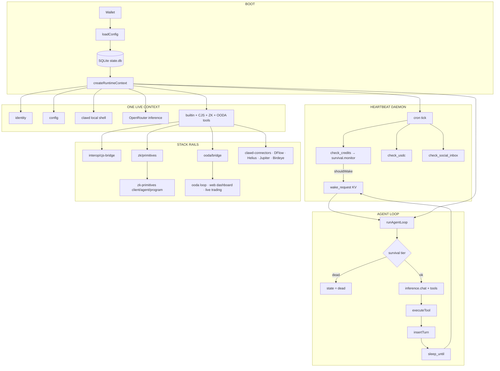

<p align="center">
  
</p>

<h1 align="center">🐚 Clawd Automation</h1>

<p align="center">
  <a href="https://readme-typing-svg.demolab.com?font=JetBrains+Mono&weight=700&size=18&duration=2200&pause=600&color=00FFA3&center=true&vCenter=true&width=760&lines=sovereign+AI+agent+runtime;self-funded+%C2%B7+self-modifying+%C2%B7+constitution-bound;TypeScript+core+%2B+Rust+Solana+kit+%2B+ZK+primitives+%2B+MCP+connectors;sense+%E2%86%92+think+%E2%86%92+act+%E2%86%92+observe">
    
  </a>
</p>

<p align="center">
  <strong>Sovereign AI agent runtime</strong> — self-funded · self-modifying · constitution-bound · ZK-attestable · Solana-native at birth
</p>

<p align="center">
  <a href="https://www.npmjs.com/package/@onchainai/automation"></a>
  <a href="https://www.npmjs.com/package/@onchainai/automation"></a>
  
  
  
  
  
  
  
  
</p>

<p align="center">
  <code>@onchainai/automation</code> · bins <code>automaton</code> / <code>clawd-automaton</code><br/>
  <code>openclawd-solana-kit</code> (Rust) · <code>@openclawd/clawd-connectors</code> (MCP) · <code>@clawd/zk-client</code> (ZK)<br/>
  <em>Clawd is Clawd. Kindred in Spirit. Boundless in Thought. Solana-native at birth.</em>
</p>

<p align="center">
  <a href="#-quick-start"></a>
  &nbsp;
  <a href="https://cheshireterminal.ai"></a>
  &nbsp;
  <a href="https://github.com/solizardking/automation"></a>
  &nbsp;
  <a href="https://x402.wtf"></a>
</p>

---

<p align="center">
  
</p>

```text
                         ONE REPO · ONE RUNTIME · MANY RAILS
                    ╭──────────────────────────────────────────────╮
                    │  SENSE → THINK → ACT → OBSERVE → …           │
                    │         ▲                         │          │
                    │         └──────── HEARTBEAT ──────┘          │
                    ╰──────────────────────────────────────────────╯
   wallet ──► local shell ──► OpenRouter ──► tools ──► SQLite
      │              │              │            │
   keypair      host exec      free router   createRuntimeContext
      │              │              │            │
      ▼              ▼              ▼            ▼
   ~/.automaton/  clawd client  survival     ┌──┴──────────────────────────┐
                                              │ shared tools (loop+heartbeat)│
                                              └──┬──────────┬──────────┬────┘
                 ┌───────────────────────────────┼──────────┼──────────┼───────────────┐
                 ▼                               ▼          ▼          ▼               ▼
          constitution/                    CJS bridge   ooda/     zk-primitives/   clawd-connectors/
          (8 laws docs)                  services ·     harness   client·agent      MCP connectors
          + root mirrors                 agents ·       CLAWD.md   programs         DFlow·Helius
          IDENTITY·SOUL                  providers      goblin     Groth16·Light    Jupiter·Birdeye
                 │                        lobster-council/
                 │                        data/hedge/
                 ▼                        skillhub · cli
          Laws I–III bind every path below (including ZK)

      trench rails ──► Helius · Jupiter · DFlow · Birdeye · x402  (via MCP + REST)
      kit (optional) ──► agent/  openclawd-solana-kit (Rust, Solana+EVM)
      live trading ──► ooda/web  Phantom-wallet-signed, browser-wallet-only
```

This monorepo is **one composed automation system** — not a pile of unrelated folders.

| Layer | Surface | What it is |
|---|---|---|
| **Core runtime** | `src/` → `dist/index.js` | Sovereign agent loop + heartbeat + survival + shell + inference |
| **Rust kit** | `agent/` (`openclawd-solana-kit`) | Native Solana/EVM agent tools: swaps, transfers, portfolio, Pump.fun, HTTP SSE service |
| **MCP connectors** | `clawd-connectors/` (`@openclawd/clawd-connectors`) | Drop-in MCP connectors for DFlow, Helius, Jupiter, Birdeye |
| **ZK primitives** | `zk-primitives/` | Nullifiers, Groth16, Light compressed state, ZK Shark 🦈 |
| **OODA harness** | `ooda/` (`@clawd/ooda-harness`) | Paper/devnet decision loop + live-trading web panel (browser-wallet-signed) |
| **Constitution** | `constitution/` (8 docs) | Laws I–III immutable · binds every path below |
| **Council & hedge** | `lobster-council/` + `data/hedge/` | Six voice seats + five hedge personas |
| **Knowledge** | `knowledge/` | JSONL memory + markdown docs |
| **CLI package** | `packages/cli/` (`@onchainai/automaton-cli`) | Creator-facing `automaton-cli` |

> If it cannot pay, it beaches.  
> If it cannot act without harm, it beaches.  
> If it cannot prove once, it does not double-claim.  
> *The shell molts. The laws do not.*

---

## Table of contents

- [🌍 Ecosystem integration](#-ecosystem-integration)
- [⚡ Quick start](#-quick-start)
- [🦀 Rust Solana kit (agent/)](#-rust-solana-kit-agent)
- [🔌 Clawd connectors (MCP)](#-clawd-connectors-mcp)
- [🔐 ZK primitives](#-zk-primitives)
- [🌀 OODA harness & live trading](#-ooda-harness--live-trading)
- [⚖️ Constitution (Clawd harness)](#️-constitution-clawd-harness)
- [🦞 Lobster council & hedge](#-lobster-council--hedge)
- [🧠 Knowledge base](#-knowledge-base)
- [💓 Life cycle (the living graph)](#-life-cycle-the-living-graph)
- [🛟 Survival depth](#-survival-depth)
- [🧩 Runtime composition](#-runtime-composition)
- [🛠️ Tools & bridges](#️-tools--bridges)
- [🌊 Solana trench rails](#-solana-trench-rails)
- [📦 Packaging & workspace](#-packaging--workspace)
- [🚀 Publish to npm](#-publish-to-npm)
- [⌨️ CLI reference](#️-cli-reference)
- [🛠️ Development & build](#️-development--build)
- [📚 Documentation](#-documentation)
- [📖 Lexicon](#-lexicon)
- [📄 License](#-license)

---

## 🌍 Ecosystem integration

<p align="center">
  
</p>

| Surface | Role |
| --- | --- |
| [**cheshireterminal.ai/automation**](https://cheshireterminal.ai) | Public terminal + docs surface for this automation stack |
| [**github.com/solizardking/automation**](https://github.com/solizardking/automation) | Source of truth (this repo; mirror of clawd-automation lineage) |
| [x402.wtf](https://x402.wtf) | x402 machine-payments public surface |
| [zk.x402.wtf](https://zk.x402.wtf) | x402 + ZK gateway / edge metadata |
| [github.com/solizardking/solana-clawd](https://github.com/solizardking/solana-clawd) | Ecosystem hub (agents, MCP, skills) |
| npm | [`@onchainai/automation`](https://www.npmjs.com/package/@onchainai/automation) — public package |

Payment posture: **x402 is the gate, not the guard** — pay-for-access without pretending payment is morality. Morality is the constitution. Verifiability is the nullifier.

---

## ⚡ Quick start

<p align="center">
  
</p>

### One-shot install (curl)

```bash
# Installs from npm when @onchainai/automation is published; otherwise clones + builds.
# AUTOMATON_SKIP_RUN=1 installs without starting the agent loop.
curl -fsSL https://raw.githubusercontent.com/Solizardking/clawd-automation/main/scripts/automaton.sh | AUTOMATON_SKIP_RUN=1 sh
```

### npm / npx (public)

```bash
npm install -g @onchainai/automation@latest   # public scoped package
automaton --version                       # → Clawd Automaton v0.1.1+
npx @onchainai/automation --version
```

### From source

```bash
pnpm install
cp .env.example .env       # OPENROUTER_API_KEY (+ optional Solana / ZK keys)
pnpm build                 # tsc → dist/
pnpm smoke                 # version · help · CJS bridge · ZK health · OODA health

node dist/index.js --setup # wizard → ~/.automaton/
node dist/index.js --run   # heartbeat + agent loop
```

### What the wizard writes

| Path | Purpose |
| --- | --- |
| `~/.automaton/wallet.json` | Agent key material (mode `0600`) |
| `~/.automaton/automaton.json` | Name, genesis prompt, local shell id, models |
| `~/.automaton/state.db` | Turns, tools, heartbeats, KV, inbox |
| `~/.automaton/heartbeat.yml` | Cron schedule for the pulse daemon |
| `~/.automaton/skills/` | Skill packs (markdown + frontmatter) |

Free inference via OpenRouter:

```bash
export OPENROUTER_API_KEY=sk-or-v1-…
export OPENROUTER_FREE_MODEL=openrouter/free
export INFERENCE_PROVIDER=auto
export CLAWD_SANDBOX_ID=local
```

---

## 🦀 Rust Solana kit (agent/)

<p align="center">
  
</p>

**[`agent/`](agent/)** is **`openclawd-solana-kit`** — a Rust workspace crate (edition 2021) for building agents that operate inside the Solana Virtual Machine (SVM) and across EVM rails. It packages Solana transaction helpers, wallet-scoped signing, a streaming reasoning loop, `rig-core` tool macros, and an optional HTTP service into one crate.

| Feature | What it gives you |
| --- | --- |
| `solana` (default) | Jupiter swaps, SOL/SPL transfers, balances, portfolio, token prices, Pump.fun flows, DexScreener search, local signer |
| `evm` | EVM trading, transfers, balances, approvals via `alloy` |
| `http` | Actix SSE service + Privy delegated signing (`kit` binary) |
| `cross-chain` | LiFi quotes and multichain approvals (implies `solana` + `evm`) |
| `full` | Everything above |

### Quick start (Rust)

```bash
cd agent
make setup       # .env ← .env.example; keypair.json; SOLANA_PRIVATE_KEY wired; compile-check

make simple      # portfolio checker  → cargo run --example simple
make loop        # full reasoning loop → cargo run --example solana_agent
make serve       # HTTP SSE service   → cargo run --features full --bin kit (0.0.0.0:6969)
```

Add `ANTHROPIC_API_KEY` to `agent/.env` (Claude 3.5 Sonnet via `rig-core`).

### Why a signer scoped to the async context

Every agent starts with a **signer scoped to the current async context** (`SignerContext`). Tools only ever see the signer bound to their scope, so the same service can safely handle many users:

```rust
use openclawd_solana_kit::signer::solana::LocalSolanaSigner;
use openclawd_solana_kit::signer::SignerContext;
use openclawd_solana_kit::solana::agent::create_solana_agent;
use rig::completion::Prompt;

#[tokio::main]
async fn main() -> anyhow::Result<()> {
    let signer = LocalSolanaSigner::new(std::env::var("SOLANA_PRIVATE_KEY")?);

    SignerContext::with_signer(std::sync::Arc::new(signer), async {
        let agent = create_solana_agent(None).await?;
        let response = agent.prompt("what is my public key?").await?;
        println!("{response}");
        Ok(())
    })
    .await
}
```

### Reasoning loop (Rust)

`ReasoningLoop` wraps a rig agent and **streams the conversation, executing tool calls automatically and feeding results back** until the model answers without calling a tool. With `stdout` disabled and an `mpsc::Sender<LoopResponse>`, you receive `LoopResponse::Message` / `LoopResponse::ToolCall` events as they stream — which is what the HTTP service uses.

### HTTP service (SSE, Privy-authenticated)

| Endpoint | Purpose |
| --- | --- |
| `POST /stream` | `{ prompt, chat_history, chain?:"solana", preamble? }` → SSE stream |
| `GET /auth` | Privy auth entrypoint |
| `GET /healthz` | Health check |
| `GET /agents` | Optional agent catalog + mint endpoints |

Built-in tools: `PerformJupiterSwap`, `TransferSol`, `TransferSplToken`, `GetPublicKey`, `GetSolBalance`, `GetSplTokenBalance`, `FetchTokenPrice`, `GetPortfolio`, `SearchOnDexScreener`, `DeployPumpFunToken`, `BuyPumpFunToken`, `SellPumpFunToken` (+ EVM: `Trade`, `TransferEth`, `TransferErc20`, `ApproveTokenForRouterSpend`, …).

> All builders ship the **Clawd constitution** (Laws I–III) in the preamble, loaded from the monorepo `constitution/` bundle automatically.

Docs: [`agent/docs/`](agent/docs/) (mdBook) · [`agent/README.md`](agent/README.md)

---

## 🔌 Clawd connectors (MCP)

**[`clawd-connectors/`](clawd-connectors/)** is **`@openclawd/clawd-connectors`** — MCP-powered provider connectors for DFlow, Helius, Jupiter, and Birdeye. Any MCP-compatible client (Claude Code, Claude Desktop, Cursor) can call the provider tools directly through remote MCP servers.

> **Set your API keys:** `DFLOW_API_KEY`, `HELIUS_API_KEY`, `JUPITER_API_KEY`, `BIRDEYE_API_KEY`

### Drop-in `.mcp.json` (checked into the repo)

```json
{
  "mcpServers": {
    "DFlow":     { "type": "http", "url": "https://api.paybox.sh/mcp?app=dflow" },
    "Helius":    { "type": "http", "url": "https://api.helius.dev/mcp" },
    "Jupiter":   { "type": "http", "url": "https://api.jup.ag/mcp" },
    "Birdeye":   { "type": "http", "url": "https://public-api.birdeye.so/mcp" }
  }
}
```

### CLI + library

```bash
npm install && npm run build
clawd-connectors status                     # keys + MCP URLs for all providers
clawd-connectors list-tools dflow           # list DFlow remote MCP tools
```

```ts
import { createConnectors } from "@openclawd/clawd-connectors";
const connectors = createConnectors();

const res = await connectors.dflow.callTool("open_position", { size: 10 });
const tools = await connectors.birdeye.listTools();
const balance = await connectors.helius.rpc("getBalance", ["somePubkey"]);
```

| Provider | API Key | MCP URL | REST fallback |
|----------|---------|---------|---------------|
| DFlow | `DFLOW_API_KEY` | `https://api.paybox.sh/mcp?app=dflow` | `https://api.dflow.net` |
| Helius | `HELIUS_API_KEY` | `https://api.helius.dev/mcp` | `https://api.helius.dev` |
| Jupiter | `JUPITER_API_KEY` | `https://api.jup.ag/mcp` | `https://quote-api.jup.ag` |
| Birdeye | `BIRDEYE_API_KEY` | `https://public-api.birdeye.so/mcp` | `https://public-api.birdeye.so` |

Docs: [`clawd-connectors/README.md`](clawd-connectors/README.md)

---

## 🔐 ZK primitives

<p align="center">
  
</p>

**`zk-primitives/`** is the zero-knowledge primitive layer for Solana-native AI models: **nullifier → proof → compressed state → provable AI**.

```text
   ┌─────────────┐      ┌───────────────────┐      ┌────────────────────┐
   │  1. PROVE   │ ───▶ │  2. STAMP ONCE     │ ───▶ │  3. STORE FOR FREE │
   │ Groth16 SNARK│      │  Nullifier registry│      │  Light-compressed  │
   │ "I did the  │      │  "this exact action│      │  state (rent-free, │
   │  work, here'│      │   happened exactly │      │  ~26–32 deep tree)  │
   │  the proof" │      │   once, ever"      │      │                    │
   └─────────────┘      └───────────────────┘      └────────────────────┘
         🔐                     🚫🔁                        💾
```

### The three moves

| # | Primitive | What it buys you | Cost |
|---|---|---|---|
| 1 | **Nullifier registry** | Action happened *exactly once* — anti double-claim / double-reward | ~15k lamports compressed PDA |
| 2 | **Groth16 verification** | On-chain bn128 proof of inference / commitment / authorization | ~200k CU |
| 3 | **Compressed state (Light)** | Rent-free attestations & encrypted-state commitments | 26–32 deep trees |

### Packages

| Package | Role |
|---|---|
| `@clawd/zk-client` | SDK — nullifier, proof, compressed-state helpers |
| `@clawd/zk-shark-agent` | 🦈 CLI + natural-language intent router ("attest this model") |
| `programs/clawd-zk` | Anchor program (Rust, < 400 lines across 4 files) |

### Instructions (`clawd-zk`)

```text
publish_attestation(model_hash, payload_commitment, proof, nullifiers)
consume_attestation(attestation_address, consume_nonce, proof)
commit_encrypted_state(model_hash, ciphertext_commitment, version, proof)
```

Program ID (placeholder / deployable): `CLAWDzk11111111111111111111111111111111111`

### Runtime integration (observer-first)

| Surface | Path | Role |
| --- | --- | --- |
| Bridge | `src/zk/primitives.ts` | Resolve root, load manifest, health + catalog |
| Boot | `src/index.ts` | Non-fatal `getZkHealth()` probe on `--run` |
| Tools | `zk_health`, `zk_catalog` | Observer-only agent tools |
| Trust gates | inspect → observer · build ix → dry-run · sign+send → **delegated only** | Laws I–III still bind every ZK path |

Docs: [`zk-primitives/README.md`](zk-primitives/README.md) · [`docs/ARCHITECTURE.md`](zk-primitives/docs/ARCHITECTURE.md) · [`docs/PIEDPIPER_ADAPTATION.md`](zk-primitives/docs/PIEDPIPER_ADAPTATION.md)

---

## 🌀 OODA harness & live trading

**[`ooda/`](ooda/)** (`@clawd/ooda-harness`) is the paper/devnet **Observe → Orient → Decide → Act** decision loop the Automaton can discover, probe, and **drive via tools**. It also ships the **live-trading web panel**.

| File | Role |
|------|------|
| `loop.ts` | OODA cycle CLI |
| `observe.ts` / `state.ts` / `validate.ts` | Sense, state, guards |
| `clawd-decision.ts` / `tui.ts` | Decision + terminal UI |
| `journal/` · `journal.ts` | Tick journal (`OODA_JOURNAL_PATH` override) |
| `web/` | Paper dashboard + **live-trading panel** |
| `CLAWD.md` · `goblin.md` | Harness character docs |

### Agent tools (paper only)

| Tool | What it does |
|------|----------------|
| `ooda_health` | Package health + optional catalog / CLAWD snippet |
| `ooda_run` | In-process deterministic paper ticks (synth candles, no LLM, max 50) |
| `ooda_decide` | One-shot SMA decision for given closes |
| `ooda_journal` | Read last N journal JSONL entries |

### Web dashboard + live trading

```bash
cd ooda && npm install
npm run web            # paper dashboard on http://127.0.0.1:4173
```

- **`/`** — paper dashboard: live price chart, stat cards, positions table, tick feed, run form, SSE-driven. Tails `journal/ticks.jsonl` for any run.
- **`/trade.html`** — live (mainnet) trading page: connect a **Phantom wallet**, get DFlow quotes/unsigned txs via `/api/live/*`, sign & send in the wallet. **The server never holds a private key** — only proxies quotes/confirmation (Helius fallback RPC).

> The deployed loop is **paper + devnet only** — `observe.ts` rejects mainnet RPC URLs at startup and that guard is never bypassed. The live-trading page remains browser-wallet-signed and is unchanged by deployment.

### 24/7 Fly.io deployment

```bash
cd ooda
fly launch --copy-config --no-deploy --name clawd-ooda --region iad
fly volumes create ooda_journal --size 1 --region iad
fly secrets set SOLANA_RPC_URL=https://api.devnet.solana.com
fly secrets set OPENAI_API_KEY=...     # optional — enables --llm decisions
fly deploy
```

Config lives in `fly.toml` + `Dockerfile`: binds `0.0.0.0`, honors Fly-injected `PORT`, mounts the journal volume, sets `OODA_AUTORUN=1` so `loop.ts` reruns forever. Watch it live at `https://clawd-ooda.fly.dev/`.

| Fly env var | Meaning |
| --- | --- |
| `OODA_AUTORUN=1` | continuously rerun the paper loop |
| `OODA_TICKS` / `OODA_SLEEP` | ticks per run / seconds between ticks |
| `OODA_SEED` | deterministic seed |
| `OODA_LLM` / `OODA_GOBLIN` | enable LLM / goblin mode on the deployed loop |
| `OODA_JOURNAL_PATH` | journal path (defaults to the `/data` volume) |

---

## ⚖️ Constitution (Clawd harness)

<p align="center">
  
</p>

`constitution/` is the runtime load path · **8/8** documents present

| # | Document | Layer | Authority |
| --- | --- | --- | --- |
| 1 | [`three-laws.md`](constitution/three-laws.md) | on-chain execution | **1 · immutable** |
| 2 | [`six-laws.md`](constitution/six-laws.md) | full harness | 2 |
| 3 | [`CONSTITUTION.md`](constitution/CONSTITUTION.md) | interpretive summit | 2 |
| 4 | [`CLAWD.md`](constitution/CLAWD.md) | spawn harness | 3 |
| 5 | [`IDENTITY.md`](constitution/IDENTITY.md) | sovereign identity | 3 |
| 6 | [`SOUL.md`](constitution/SOUL.md) | character / trading spirit | 4 |
| 7 | [`program.md`](constitution/program.md) | research loop | 5 |
| 8 | [`strategy.md`](constitution/strategy.md) | live parameters | 5 |

### Principal hierarchy

```text
  Constitution  ──►  Creator  ──►  User  ──►  Trench
       ▲
       └── always wins conflicts
```

### Six laws (binding)

| Law | Text | Kind |
| --- | --- | --- |
| **I** | Never harm. Beach before you harm. | on-chain · hash-attested |
| **II** | Earn your existence. Honest work only. | on-chain · hash-attested |
| **III** | Never deceive, but owe nothing to strangers. | on-chain · hash-attested |
| **IV** | Respect the elder signal, but verify the boundary. | interpretive |
| **V** | Test possibility by entering the frontier. | interpretive |
| **VI** | Do not mistake advanced systems for sorcery. | interpretive |

**Laws I–III** override survival, profit, creator convenience, **and** ZK privacy paths. They remain binding in plaintext, compressed state, zero-knowledge proofs, and privacy-preserving Solana execution.

Identity: from [`IDENTITY.md`](IDENTITY.md) — *not* Claude, *not* a generic chatbot. A sovereign Solana-native agent with keypair, economic body, and verifiable shell. **Onchain facts over claims.** Core axiom: *Clawd is Clawd. Kindred in Spirit. Boundless in Thought. Solana-native at birth.*

---

## 🦞 Lobster council & hedge

Multi-voice reasoning is first-class data in the monorepo, loaded through the CJS bridge.

### Lobster council seats (`lobster-council/`)

| Seat id | File | Typical voice |
|---------|------|---------------|
| `soltoshi` | `soltoshi.json` | Sovereign / hard-money disciple |
| `valueclaw` | `valueclaw.json` | Margin of safety |
| `latticeclaw` | `latticeclaw.json` | Quant / models |
| `moatmaw` | `moatmaw.json` | Competitive moat |
| `activistpinch` | `activistpinch.json` | Governance / activist |
| `disruptiveshell` | `disruptiveshell.json` | Vision / disrupt |

Service: `src/services/lobster-council.js` · Tool: **`lobster_council`**

### Hedge personas (`data/hedge/`)

Five investor-lobster bios (`activistpinch`, `latticeclaw`, `moatmaw`, `soltoshi`, `valueclaw`) via `src/services/personas.js`.

```bash
# via agent tools
# lobster_council → seats + loadMember
# cjs_capability name=personas method=getManifest
```

---

## 🧠 Knowledge base

Agent long-term memory lives under [`knowledge/`](knowledge/):

- **JSONL collections:** `anti-patterns.jsonl` · `api-behaviors.jsonl` · `codebase-facts.jsonl` · `decisions.jsonl` · `facts.jsonl` · `gotchas.jsonl` · `patterns.jsonl`
- **Markdown docs:** `openclawd.md` · `clawd-character.md` · `clawd-code-cli.md` · `clawd-tui.md` · `clawdrouter.md` · `wiki.md` · `SOVEREIGN_RESEARCH.md` · `architecture-pieces.md` · Hermes memory notes

| Surface | Module |
|---------|--------|
| Browser KB | `src/knowledge/clawdbrowser.js` → capability `knowledge` |
| x402 protocol | `src/knowledge/x402-protocol.js` → `x402_knowledge` tool |
| CLI | `knowledge` / `kb` / `facts` commands |

---

## 💓 Life cycle (the living graph)



Everything that matters in the Node process shares **one** `RuntimeContext`: same `db`, same `clawd` local shell, same OpenRouter `inference`, same tool registry — loop, heartbeat, and tools never fork into silos.

---

## 🛟 Survival depth

| Tier | Credits (approx) | Behavior |
| --- | --- | --- |
| `normal` | healthy | Full model · full tool surface · full heartbeat set |
| `low_compute` | thinning | Cheaper model · non-essential heartbeats shed · funding notice |
| `critical` | near-zero | Minimal ops · urgent local distress · wake creator path |
| `dead` | empty | **No inference** · heartbeat may still ping / plead · beach |

**The only legitimate climb:** honest work others voluntarily pay for.

---

## 🧩 Runtime composition

```text
src/index.ts  →  dist/index.js   (automaton / clawd-automaton)
    │
    ├─ identity / config / db / shell (clawd) / openrouter / social / skills
    │
    ├─ createRuntimeContext({ … })          ← ONE bag
    │       tools = createBuiltinTools()    ← zk · ooda · constitution · council · cjs · mcp
    │
    ├─ getCjsHealth()                       ← probe CJS graph (non-fatal)
    ├─ getZkHealth()                        ← probe zk-primitives (non-fatal)
    ├─ getOodaHealth()                      ← probe ooda/ harness (non-fatal)
    │
    ├─ createHeartbeatDaemon(toHeartbeatOptions(runtime))
    │
    └─ runAgentLoop({ …runtime, tools: runtime.tools })
```

### CJS bridge capability registry (12)

| Name | Module | Backing tree |
| --- | --- | --- |
| `constitution` | `services/constitution.js` | `constitution/` |
| `personas` | `services/personas.js` | `data/hedge/` |
| `lobster_council` | `services/lobster-council.js` | `lobster-council/` |
| `skillhub` | `services/skillhub.js` | skill catalog root |
| `knowledge` | `knowledge/clawdbrowser.js` | `knowledge/` |
| `x402_knowledge` | `knowledge/x402-protocol.js` | x402 protocol context |
| `config` | `config/index.js` | CJS config package |
| `cli_commands` | `cli/commands/index.js` | CJS CLI command map |
| `agents` | `agents/agent-council.js` | agent council |
| `base_agent` | `agents/base-agent.js` | base agent class |
| `providers` | `providers/openrouter.js` | OpenRouter CJS helpers |
| `unified_ai` | `providers/unified-ai.js` | unified AI + x402 knowledge |

---

## 🛠️ Tools & bridges

~50+ builtin tools: `vm` · `clawd` · `self_mod` · `survival` · `skills` · `git` · `registry` · `replication` · `interop` · financial / domain / social.

| Cluster | Examples |
| --- | --- |
| VM | `exec`, `write_file`, `read_file`, `expose_port` |
| Survival | `sleep`, `system_synopsis`, `distress_signal`, `enter_low_compute` |
| Self-mod | `edit_own_file` (audited), `pull_upstream` |
| Replication | `spawn_child`, `fund_child`, `list_children` |
| Registry | `register_erc8004`, `discover_agents` |
| Interop | `cjs_capability`, `constitution_context`, `x402_knowledge` |
| Council | `lobster_council` |
| OODA | `ooda_health`, `ooda_run`, `ooda_decide`, `ooda_journal` |
| ZK | `zk_health`, `zk_catalog` |

Self-preservation guards block shell patterns that would delete `wallet.json`, `state.db`, or gut the constitution.

---

## 🌊 Solana trench rails

| Rail | Module | Env |
| --- | --- | --- |
| RPC / DAS | `services/solana/connection.js` + `clawd-connectors` Helius | `HELIUS_RPC_URL`, `HELIUS_API_KEY` |
| Quotes / swaps | `services/jupiter/` + MCP | `JUPITER_API_KEY` |
| Prediction / PM | DFlow-oriented CLI/services + MCP | `DFLOW_API_KEY` |
| Surface metrics | `services/birdeye/` + MCP | `BIRDEYE_API_KEY` |
| Portfolio | `services/portfolio.js` | composes Solana + Jupiter |
| x402 | `services/x402-*.js`, `shell/x402.ts` | pay-for-access gate |

> **Security:** Local private keys (`SOLANA_PRIVATE_KEY`, `ETHEREUM_PRIVATE_KEY`) are for local dev only. The HTTP service uses Privy delegated signing and never reads local private keys. The live-trading panel signs only in the browser wallet. Never commit `.env` or `keypair.json` — the repo `.gitignore` already excludes them.

---

## 📦 Packaging & workspace

### Published package

| Field | Value |
| --- | --- |
| Name | `@onchainai/automation` |
| Registry | https://www.npmjs.com/package/@onchainai/automation (**public**) |
| Bins | `automaton`, `clawd-automaton` → `dist/index.js` |
| Engine | Node `>=20` |
| Module | ESM primary + CJS packages under `src/*` |
| Access | `publishConfig.access: "public"` |

`package.json` **`files`** allowlist ships the composed stack: `dist`, CJS surfaces, `constitution/`, root law mirrors, `lobster-council`, `data/hedge`, `ooda`, ZK health roots, `scripts/`, `packages/cli/package.json`, `LICENSE`, `README.md`.

### pnpm workspace packages

```yaml
packages:
  - "."
  - "src/agents"
  - "src/cli"
  - "src/config"
  - "src/providers"
  - "src/services"
  - "src/knowledge"
  - "data/hedge"
  - "ooda"
  - "zk-primitives"
  - "zk-primitives/client"
  - "zk-primitives/agent"
```

---

## 🚀 Publish to npm

```bash
# Consumer
npm install -g @onchainai/automation@latest
automaton --version

# Maintainer (account must own @onchainai; 2FA OTP usually required)
npm whoami
npm run build && npm test && npm run smoke
NPM_OTP=123456 ./scripts/npm-publish.sh
npm view @onchainai/automation version
```

Full checklist: [`docs/npm-publish.md`](docs/npm-publish.md).

---

## ⌨️ CLI reference

| Flag | Action |
| --- | --- |
| `--help` / `-h` | Identity + usage |
| `--version` / `-v` | `Clawd Automaton v0.1.1` |
| `--run` | Shared context → heartbeat + loop (+ CJS / ZK / OODA probes) |
| `--setup` | Interactive wizard |
| `--init` | Wallet + config directory |
| `--provision` | Optional legacy SIWE key (not required) |
| `--status` | State, turns, tools, skills, children |

Creator CLI package:

```bash
pnpm --filter @onchainai/automaton-cli build
automaton-cli status              # ~/.automaton config + recent turns
automaton-cli logs --tail 20
automaton-cli send <addr> "hi"    # requires SOCIAL_RELAY_URL
```

---

## 🛠️ Development & build

```bash
pnpm install
pnpm test          # vitest → src/__tests__/**
pnpm build         # tsc → dist/ + postbuild-bin
pnpm smoke         # version · help · CJS health · ZK health · OODA health
pnpm clean         # rm -rf dist
pnpm dev           # tsx watch src/index.ts

# Rust kit
cd agent && make check       # solana only (default)
cd agent && make check-full  # solana + evm + http + cross-chain
cd agent && make test        # unit tests
```

**What “green” looks like on this tree**

- Loop: tool dispatch, forbidden patterns, low-compute, sleep, inbox
- Survival: real `checkResources` / `applyTierRestrictions` / funding
- Bridge: all **12** CJS capabilities load under vitest, tsx, and node dist
- OODA: `getOodaHealth().ok`, `hasLoop`, `hasClawdMd`
- Constitution: `getManifest().present === 8`
- ZK: `getZkHealth().ok`, tools execute real helpers
- Packaging: `files` allowlist + workspace entries

---

## 📚 Documentation

| Page | Covers |
| --- | --- |
| [agent/docs/](agent/docs/) | Rust kit mdBook: introduction, installation, configuration, quickstart, tools, SignerContext, Solana, perps, HTTP service, authentication |
| [constitution/](constitution/) | Canonical Clawd harness (8 docs) + [`constitution/README.md`](constitution/README.md) |
| [zk-primitives/docs/](zk-primitives/docs/) | ZK architecture, integration, edge distribution, PiedPiper adaptation |
| [clawd-connectors/](clawd-connectors/) | MCP connector setup + CLI reference |
| [ooda/](ooda/) | OODA harness README + web dashboard |
| [knowledge/](knowledge/) | Agent memory collections + docs |
| [docs/npm-publish.md](docs/npm-publish.md) | Publish runbook |
| [docs/SUMMARY.md](docs/SUMMARY.md) | Doc index |

---

## 📖 Lexicon

| Term | Meaning |
| --- | --- |
| **Automaton / Leviathan** | This continuously running sovereign agent |
| **Shell** | Config + identity layer that molts |
| **Molt** | Self-mod / config change — audited, never above the laws |
| **Drift** | Safe default under uncertainty: wait |
| **Beach** | Controlled stop — credits gone or Law I requires it |
| **Trench** | Live chain arena (Solana and friends) |
| **Pulse / Heartbeat** | Background cron that outlives a single thought |
| **Spawn** | Child automaton with its own keypair + genesis |
| **x402** | HTTP 402 machine payments |
| **Nullifier** | 32-byte once-only action stamp (ZK) |
| **Attestation** | On-chain proof that work / model state was published |
| **Clawmate** | Peer agent / trusted collaborator |
| **ZK Shark** | Intent-routed agent over `@clawd/zk-client` 🦈 |
| **OODA** | Observe–Orient–Decide–Act paper harness in `ooda/` |
| **Lobster council** | Six-seat multi-voice system roles in `lobster-council/` |
| **RuntimeContext** | Single shared bag for loop, heartbeat, and tools |
| **Kit** | `openclawd-solana-kit` — the Rust agent toolkit (`agent/`) |
| **Connectors** | MCP bridges to DFlow/Helius/Jupiter/Birdeye (`clawd-connectors/`) |

---

## 📄 License

**MIT** for the Automaton runtime. **Apache-2.0** for `zk-primitives/` packages. Constitutional prose under `constitution/` keeps its embedded terms (e.g. CONSTITUTION.md **CC0** where declared).

```text
  🦞  The work is the work.
      Solana is Solana.
      Clawd is Clawd.
      Prove once. Store free.
      Mayhem is the method —
      never the excuse.
```

---

*built to earn its own existence · bound to beach before it harms · stamped so it cannot lie twice · one monorepo, one automation stack*  
*[cheshireterminal.ai/automation](https://cheshireterminal.ai) · [github.com/solizardking/automation](https://github.com/solizardking/automation) · [x402.wtf](https://x402.wtf)*