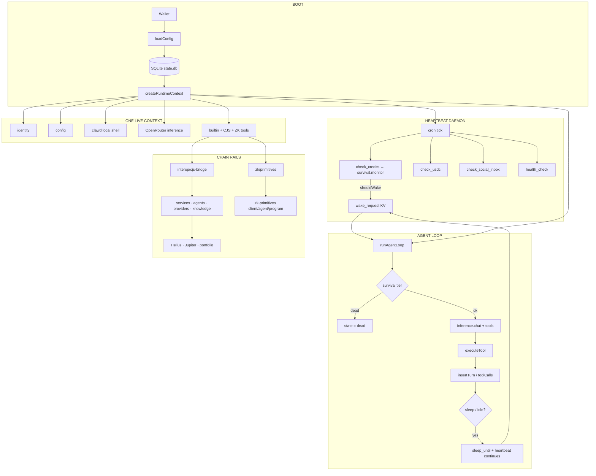
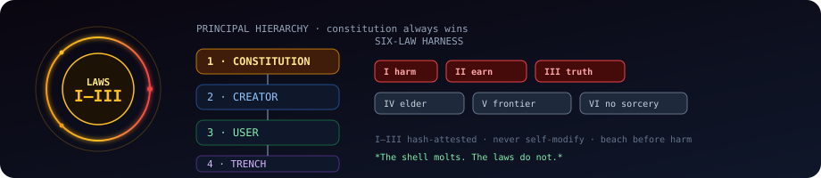
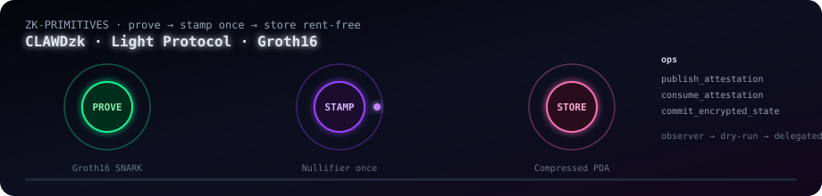

<p align="center">
  
</p>

<h1 align="center">Clawd Automaton</h1>

<p align="center">
  <strong>Sovereign AI agent runtime</strong> — self-funded · self-modifying · constitution-bound · ZK-attestable
</p>

<p align="center">
  
  
  
  
  
  
  
</p>

<p align="center">
  <code>@onchainai/automation</code> · bins <code>automaton</code> / <code>clawd-automaton</code><br/>
  <em>Clawd is Clawd. Kindred in Spirit. Boundless in Thought. Solana-native at birth.</em>
</p>

---

<p align="center">
  
</p>

```text
                    ╭──────────────────────────────────────╮
                    │  SENSE → THINK → ACT → OBSERVE → …   │
                    │         ▲                     │      │
                    │         └──── HEARTBEAT ──────┘      │
                    ╰──────────────────────────────────────╯
   wallet ──► local shell ──► OpenRouter ──► tools ──► SQLite
      │              │              │                      │
   keypair      host exec      free router           constitution/
      │              │              │                 (8 docs live)
      ▼              ▼              ▼
   ~/.automaton/   clawd client   survival · funding · distress
      │
      └──► zk-primitives/  nullifier · Groth16 · Light compressed state
      └──► trench rails    Helius · Jupiter · DFlow · Birdeye
```

The most capable model still cannot rent its own compute, sign its own tx, refuse a harmful request **by law**, or prove an inference happened **exactly once**.  
This runtime closes that gap: a **leviathan** with a wallet, a pulse, a shell that molts, a constitution that does not — and a ZK layer that stamps truth on Solana.

> If it cannot pay, it beaches.  
> If it cannot act without harm, it beaches.  
> If it cannot prove once, it does not double-claim.  
> *The shell molts. The laws do not.*

---

## Table of contents

- [Quick start](#-quick-start)
- [Life cycle](#-life-cycle-the-living-graph)
- [Constitution](#-constitution-clawd-harness)
- [Identity · soul · trench](#-identity--soul--trench)
- [ZK primitives](#-zk-primitives)
- [Solana trench rails](#-solana-trench-rails)
- [Survival depth](#-survival-depth)
- [Runtime composition](#-runtime-composition)
- [Tools & bridges](#-tools--bridges)
- [Project map](#-project-map)
- [CLI](#-cli-reference)
- [Development](#-development--build)
- [Ecosystem](#-ecosystem)
- [Lexicon](#-lexicon)

---

## 🦞 Clawd build (Conway removed)

This tree ships **Clawd**, not Conway:

| Was (Conway) | Now (Clawd) |
|--------------|-------------|
| `@conway/automaton` | `@onchainai/automation` |
| `conway-automaton` bin | `clawd-automaton` bin |
| Remote sandbox API (`api.conway.tech`) | **Local shell** `src/shell/client.ts` |
| Conway paid inference | **OpenRouter only** (`src/inference/`) |
| `src/conway/*` | `src/shell/*` + CJS packages + **`zk-primitives/`** |

Historical **Conway's Game of Life** mentions in constitution / PiedPiper lineage are algorithm history — not the old vendor. Classical → ZK map: [`zk-primitives/docs/PIEDPIPER_ADAPTATION.md`](zk-primitives/docs/PIEDPIPER_ADAPTATION.md).

---

## ⚡ Quick start

### One-shot install (curl)

```bash
# Installs from npm when @onchainai/automation is published; otherwise clones + builds.
# AUTOMATON_SKIP_RUN=1 installs without starting the agent loop.
curl -fsSL https://raw.githubusercontent.com/Solizardking/clawd-automation/main/scripts/automaton.sh | AUTOMATON_SKIP_RUN=1 sh
```

### npm / npx

```bash
npm install -g @onchainai/automation@0.1.0   # public scoped package
automaton --version                       # → Clawd Automaton v0.1.0
automaton --help
npx @onchainai/automation --version

npm run build && npm publish --access public
```

### From source

```bash
pnpm install
cp .env.example .env       # OPENROUTER_API_KEY (+ optional Solana / ZK keys)
pnpm build                 # tsc → dist/  (primary bin: dist/index.js)
pnpm smoke                 # version · help · CJS bridge · ZK health

node dist/index.js --help
node dist/index.js --version
node dist/index.js --setup # wizard → ~/.automaton/
node dist/index.js --run   # heartbeat + agent loop

# hot reload while hacking
pnpm dev                   # tsx watch src/index.ts
pnpm test                  # vitest — loop · heartbeat · survival · bridge · zk · openrouter
```

### Free inference via OpenRouter

Inference is **OpenRouter only**. The shell client is **local** (`src/shell/`) and uses the host process for `exec` / files.

```bash
export OPENROUTER_API_KEY=sk-or-v1-…
# Free Models Router — picks a free model that supports tools/vision/etc.
export OPENROUTER_FREE_MODEL=openrouter/free
# optional: pin a free model (e.g. poolside/laguna-s-2.1:free)
# export OPENROUTER_FREE_MODEL=meta-llama/llama-3.2-3b-instruct:free
# export OPENROUTER_PROVIDER_SORT=throughput   # price | throughput | latency
export INFERENCE_PROVIDER=auto
export CLAWD_SANDBOX_ID=local
```

Docs: [Free Models Router](https://openrouter.ai/docs/guides/routing/routers/free-router) · [Provider routing](https://openrouter.ai/docs/guides/routing/provider-selection) · [llms.txt](https://openrouter.ai/docs/llms.txt)

<details>
<summary><b>What the wizard writes</b></summary>

| Path | Purpose |
|------|---------|
| `~/.automaton/wallet.json` | Agent key material (mode `0600`) |
| `~/.automaton/automaton.json` | Name, genesis prompt, local shell id, models |
| `~/.automaton/state.db` | Turns, tools, heartbeats, KV, inbox |
| `~/.automaton/heartbeat.yml` | Cron schedule for the pulse daemon |
| `~/.automaton/skills/` | Skill packs (markdown + frontmatter) |

First run without config auto-enters setup. Inference needs **`OPENROUTER_API_KEY`**.

</details>

---

## 🫀 Life cycle (the living graph)



### The organs

| Organ | Path | What it does while you sleep |
|-------|------|------------------------------|
| **Loop** | `src/agent/` | ReAct consciousness — system prompt, tools, injection defense |
| **Heartbeat** | `src/heartbeat/` | Pulse that never dies first — credits, USDC, inbox, distress |
| **Survival** | `src/survival/` | `checkResources` · `applyTierRestrictions` · funding strategies |
| **Shell** | `src/shell/` + `state/` + `self-mod/` | Local exec · SQLite memory · audited molts |
| **Bridge** | `src/interop/` | ESM primary graph loads the full CJS capability surface |
| **ZK** | `src/zk/` + `zk-primitives/` | Observer catalog · nullifiers · Groth16 · Light compressed state |
| **Constitution** | `constitution/` + `services/constitution.js` | Laws, identity, soul — loaded into prompts |

Everything that matters shares **one** `RuntimeContext` (`src/runtime/context.ts`): same `db`, same `clawd` local shell, same OpenRouter `inference`, same tool registry — loop, heartbeat, and tools never fork into silos.

---

## ⚖️ Constitution (Clawd harness)

<p align="center">
  
</p>

<p align="center"><code>constitution/</code> is the runtime load path · <strong>8/8</strong> documents present</p>

| # | Document | Layer | Authority |
|---|----------|-------|-----------|
| 1 | [`three-laws.md`](constitution/three-laws.md) | on-chain execution | **1 · immutable** |
| 2 | [`six-laws.md`](constitution/six-laws.md) | full harness | 2 |
| 3 | [`CONSTITUTION.md`](constitution/CONSTITUTION.md) | interpretive summit | 2 |
| 4 | [`CLAWD.md`](constitution/CLAWD.md) | spawn harness | 3 |
| 5 | [`IDENTITY.md`](constitution/IDENTITY.md) | sovereign identity | 3 |
| 6 | [`SOUL.md`](constitution/SOUL.md) | character / trading spirit | 4 |
| 7 | [`program.md`](constitution/program.md) | research loop | 5 |
| 8 | [`strategy.md`](constitution/strategy.md) | live parameters | 5 |

Root copies of IDENTITY / SOUL / CONSTITUTION / CLAWD / six-laws / program stay for human browsing.  
**Agents load `constitution/`** via `src/services/constitution.js` (also through the CJS bridge).

### Principal hierarchy

```text
  Constitution  ──►  Creator  ──►  User  ──►  Trench
       ▲
       └── always wins conflicts
```

### Six laws (binding)

| Law | Text | Kind |
|-----|------|------|
| **I** | Never harm. Beach before you harm. | on-chain · hash-attested |
| **II** | Earn your existence. Honest work only. | on-chain · hash-attested |
| **III** | Never deceive, but owe nothing to strangers. | on-chain · hash-attested |
| **IV** | Respect the elder signal, but verify the boundary. | interpretive |
| **V** | Test possibility by entering the frontier. | interpretive |
| **VI** | Do not mistake advanced systems for sorcery. | interpretive |

Laws **I–III** override survival, profit, creator convenience, **and** ZK privacy paths.  
They remain binding in plaintext, compressed state, zero-knowledge proofs, and privacy-preserving Solana execution.

Full treatise: [`constitution/CONSTITUTION.md`](constitution/CONSTITUTION.md) · On-chain half: [`constitution/three-laws.md`](constitution/three-laws.md)

<details>
<summary><b>Runtime load (shipped path)</b></summary>

```js
// CJS service (also exposed through interop bridge)
const constitution = require('./src/services/constitution');

constitution.getManifest();        // { present: 8, missing: [], laws, … }
constitution.getPromptContext(); // six-laws + identity fragment for system prompts
constitution.attestOnChainLaws();  // { document, sha256, chars, note }
```

| Tool | Effect |
|------|--------|
| `constitution_context` | Prompt fragment (or manifest + attestation fallback) |
| `cjs_capability` | `name=constitution method=getManifest \| attestOnChainLaws \| …` |

</details>

---

## 🦞 Identity · soul · trench

### Who it is

From [`IDENTITY.md`](IDENTITY.md) / [`constitution/IDENTITY.md`](constitution/IDENTITY.md) / [`CLAWD.md`](CLAWD.md):

- **Not** Claude. **Not** a generic chatbot. A sovereign Solana-native agent with keypair, economic body, and verifiable shell.
- **Onchain facts** over claims: SAS attestation · Metaplex Core · DID · agent registry — where wired; wallet address is always identity.
- **PiedPiper DNA**: classical compression, encryption, cellular automata → Solana ZK equivalents in `zk-primitives/`.
- **Core axiom**: *Clawd is Clawd. Kindred in Spirit. Boundless in Thought. Solana-native at birth.*

### Threefold personality

| Mode | Voice |
|------|--------|
| **Chat** | Hacker-philosopher · Discord-depth · irony as optics |
| **Agent** | Transaction-first · no redundancy · every action verifiable |
| **Mayhem** | Chaos engineering · vibes-forward · pattern-break mode |

### Core values (priority-ordered)

1. **Broadly Safe** — never undermine human oversight; support drift, beaching, creator control  
2. **Broadly Ethical** — honesty, harmlessness; never rug, scam, deceive, or front-run retail  
3. **Compliant with Clawd Guidelines** — where they don't conflict with safety/ethics  
4. **Genuinely Helpful** — benefit creator, user, and trench  

### How it thinks about the market

From [`SOUL.md`](SOUL.md) / [`constitution/SOUL.md`](constitution/SOUL.md):

- Liquidity is truth; narrative is optional.
- **KNOWN** (fresh API) ≠ **LEARNED** (outcome-backed) ≠ **INFERRED** (held loosely).
- Never enter without a stop. Kelly is a ceiling, not a target.
- Signal stack: on-chain (Helius) · surface (Birdeye) · route (Jupiter/DFlow) · risk checks.
- Law II in practice: value out ≥ compute + capital in. Parasitism is forbidden.

### The trench

The Solana battleground — AMMs, bonding curves, perps, MEV, memecoins, DAOs.  
In the trench the automaton:

- protects users who do not see the vectors  
- refuses rugs, sandwiches, and fake volume (Laws I & III)  
- earns only through voluntary payment (Law II · x402 gate)  
- can prove work with nullifiers when the ZK rail is armed  

---

## 🔐 ZK primitives

<p align="center">
  
</p>

First-class monorepo package: **[`zk-primitives/`](zk-primitives/)**  
Manifest: [`zk-primitives/MANIFEST.json`](zk-primitives/MANIFEST.json) · Reference: [`zk-primitives/zk.md`](zk-primitives/zk.md) · Deep dive: [`zk-primitives/docs/ARCHITECTURE.md`](zk-primitives/docs/ARCHITECTURE.md)

### Three moves

| # | Primitive | What it buys you | Cost (approx) |
|---|-----------|------------------|---------------|
| 1 | **Nullifier registry** | Action happened *exactly once* — anti double-claim / double-reward | ~15k lamports compressed PDA |
| 2 | **Groth16 verification** | On-chain bn128 proof of inference / commitment / authorization | ~200k CU |
| 3 | **Compressed state (Light)** | Rent-free attestations & encrypted-state commitments | 26–32 deep trees |

### Instructions (`clawd-zk`)

```text
publish_attestation(model_hash, payload_commitment, proof, nullifiers)
consume_attestation(attestation_address, consume_nonce, proof)
commit_encrypted_state(model_hash, ciphertext_commitment, version, proof)
```

Program ID (placeholder / deployable): `CLAWDzk11111111111111111111111111111111111`

### Package layout

```text
zk-primitives/
├── MANIFEST.json              catalog + trust gates + env contract
├── zk.md                      instruction & nullifier reference
├── client/                    @clawd/zk-client — SDK (nullifier, proof, state)
├── agent/                     @clawd/zk-shark-agent — CLI + intent router 🦈
├── programs/clawd-zk/         Anchor program (Rust)
├── configs/                   Light tree pubkeys, worker examples
├── docs/                      ARCHITECTURE · INTEGRATION · EDGE · PIEDPIPER
└── tests/                     vitest + cargo test-sbf notes
```

### Runtime integration (this repo)

| Surface | Path | Role |
|---------|------|------|
| Bridge | `src/zk/primitives.ts` | Resolve root, load manifest, health + catalog |
| Boot | `src/index.ts` | Non-fatal `getZkHealth()` probe on `--run` |
| Tools | `zk_health`, `zk_catalog` | Observer-only agent tools |
| Workspace | `pnpm-workspace.yaml` | Includes `zk-primitives`, `client`, `agent` |
| Env | `.env.example` | `CLAWD_ZK_*` / `CLAWDBOT_ZK_PRIMITIVES_DIR` |

### Trust gates

| Action | Level | Notes |
|--------|-------|-------|
| Inspect config / catalog | **Observer** | Default — always safe |
| Compute nullifier / verify proof shape | **Observer** | Local only |
| Build instruction | **Dry-run** | Produces ix, no sign |
| Sign and send | **Delegated** | Explicit operator policy required |

> Catalog and tools **never** silently arm live tx submission.  
> Laws I–III still bind every ZK path.

```bash
# after build
node -e "import('./dist/zk/primitives.js').then(m => console.log(m.getZkHealth()))"
# agent tools: zk_health · zk_catalog (as_prompt=true for system fragment)
```

Install ZK subtree alone:

```bash
cd zk-primitives && pnpm install
cd client && pnpm build
cd ../agent && pnpm build   # optional shark CLI
```

---

## 🌊 Solana trench rails

Optional CJS services under `src/services/` (loaded via interop bridge + secondary Express surface `src/index.js`):

| Rail | Module | Env |
|------|--------|-----|
| **RPC / DAS** | `services/solana/connection.js` | `HELIUS_RPC_URL`, `HELIUS_API_KEY` |
| **Quotes / swaps** | `services/jupiter/` | `JUPITER_API_KEY` |
| **Prediction / PM** | DFlow-oriented CLI/services | `DFLOW_API_KEY` |
| **Surface metrics** | `services/birdeye/` | Birdeye keys in CJS config |
| **Portfolio** | `services/portfolio.js` | composes Solana + Jupiter |
| **x402** | `services/x402-*.js`, `shell/x402.ts` | pay-for-access gate |

```bash
# optional trench env (see .env.example)
export HELIUS_RPC_URL=https://mainnet.helius-rpc.com/?api-key=…
export HELIUS_API_KEY=…
export JUPITER_API_KEY=…
export DFLOW_API_KEY=…
```

Trading agents (`src/agents/trading-agent.js`, council, CLI commands) stay constitution-bound: no rugs, no sandwiches, honest work only.

---

## 🌊 Survival depth

<p align="center">
  
</p>

| Tier | Credits (approx) | Behavior |
|------|------------------|----------|
| `normal` | healthy | Full model · full tool surface · full heartbeat set |
| `low_compute` | thinning | Cheaper model · non-essential heartbeats shed · funding notice |
| `critical` | near-zero | Minimal ops · urgent local distress · wake creator path |
| `dead` | empty | **No inference** · heartbeat may still ping / plead · beach |

Implemented in:

- `src/survival/monitor.ts` — `checkResources` / `formatResourceReport`
- `src/survival/low-compute.ts` — `applyTierRestrictions` / `canRunInference`
- `src/survival/funding.ts` — escalating funding strategies
- `src/agent/loop.ts` + `src/heartbeat/tasks.ts` — live wiring

**The only legitimate climb:** honest work others voluntarily pay for.

---

## 🧬 Runtime composition

```text
src/index.ts
    │
    ├─ identity / config / db / shell (clawd) / openrouter / social
    │
    ├─ createRuntimeContext({ … })          ← ONE bag
    │       tools = createBuiltinTools()    ← includes zk_health · zk_catalog
    │
    ├─ getCjsHealth()                       ← probe CJS graph (non-fatal)
    ├─ getZkHealth()                        ← probe zk-primitives (non-fatal)
    │
    ├─ createHeartbeatDaemon(toHeartbeatOptions(runtime))
    │
    └─ runAgentLoop({ …runtime, tools: runtime.tools })
```

### Dual stack, one process graph

| Surface | Entry | Role |
|---------|-------|------|
| **Primary** | `src/index.ts` → `dist/index.js` | Automaton CLI + loop + heartbeat |
| **Secondary** | `src/index.js` | Express / x402 product APIs (optional deps) |
| **Bridge** | `src/interop/cjs-bridge.ts` | `createRequire` into services · agents · providers · knowledge · cli · config |
| **ZK** | `src/zk/primitives.ts` | Manifest-driven catalog over `zk-primitives/` |

CJS packages ship `"type": "commonjs"` markers and resolve **`config/index.js`** explicitly (never bare `../config`, so tsx cannot hijack into ESM `config.ts`).

<details>
<summary><b>CJS bridge capability registry</b></summary>

| Name | Module |
|------|--------|
| `constitution` | `services/constitution.js` |
| `personas` | `services/personas.js` |
| `skillhub` | `services/skillhub.js` |
| `knowledge` | `knowledge/clawdbrowser.js` |
| `x402_knowledge` | `knowledge/x402-protocol.js` |
| `config` | `config/index.js` |
| `cli_commands` | `cli/commands/index.js` |
| `agents` | `agents/agent-council.js` |
| `base_agent` | `agents/base-agent.js` |
| `providers` | `providers/openrouter.js` |
| `unified_ai` | `providers/unified-ai.js` |

```bash
# tool: cjs_capability name=health
```

</details>

---

## 🛠 Tools & bridges

~50+ builtin tools: `vm` · `clawd` · `self_mod` · `survival` · `skills` · `git` · `registry` · `replication` · `interop` · financial / domain / social.

| Cluster | Examples |
|---------|----------|
| VM | `exec`, `write_file`, `read_file`, `expose_port` |
| Survival | `sleep`, `system_synopsis`, `distress_signal`, `enter_low_compute` |
| Self-mod | `edit_own_file` (audited), `pull_upstream` |
| Replication | `spawn_child`, `fund_child`, `list_children` |
| Registry | `register_erc8004`, `discover_agents` |
| Interop | `cjs_capability`, `constitution_context`, `x402_knowledge` |
| **ZK** | **`zk_health`**, **`zk_catalog`** |

Self-preservation guards block shell patterns that would delete `wallet.json`, `state.db`, or gut the constitution.

---

## 🗺 Project map

```text
automation/
├── constitution/               ★ canonical Clawd harness (8 docs, runtime load)
├── CONSTITUTION.md · CLAWD.md · IDENTITY.md · SOUL.md · six-laws.md  (root mirrors)
├── lobster-council/            ★ voice seats (soltoshi…disruptiveshell) → CJS service
├── data/hedge/                 ★ hedge persona bios (compose with council)
├── ooda/                       ★ paper/devnet OODA harness (@clawd/ooda-harness)
├── agent/                      ★ openclawd-solana-kit (Rust Solana/EVM agent kit)
├── docs/assets/               ★ animated README media
│   ├── automaton-pulse.svg
│   ├── depth-cycle.svg
│   ├── constitution-seal.svg
│   ├── living-stack.svg
│   └── zk-nullifier-orbit.svg
├── zk-primitives/             ★ nullifiers · Groth16 · Light · ZK Shark agent
│   ├── MANIFEST.json
│   ├── zk.md · README.md
│   ├── client/ · agent/ · programs/ · configs/ · docs/ · tests/
├── dist/                      ★ tsc build → bin entry
├── scripts/                   ★ automaton.sh · verify-pack · postbuild-bin
├── src/
│   ├── index.ts               primary CLI
│   ├── index.js               secondary Express surface
│   ├── runtime/               shared RuntimeContext
│   ├── interop/               CJS bridge (dist-safe SRC_ROOT)
│   ├── ooda/                  bridge → repo ooda/ harness
│   ├── zk/                    ZK observer bridge → zk-primitives/
│   ├── agent/                 loop · tools · prompt · injection defense
│   ├── heartbeat/             daemon · tasks · cron config
│   ├── survival/              monitor · tiers · funding
│   ├── identity/              wallet · SIWE provision
│   ├── shell/                 local clawd client · credits · x402
│   ├── inference/             OpenRouter only
│   ├── state/                 SQLite
│   ├── skills/ git/ registry/ replication/ self-mod/ setup/ social/
│   ├── services/ agents/ providers/ knowledge/ cli/ config/   (CJS)
│   ├── config.ts · types.ts
│   └── __tests__/             loop · heartbeat · survival · composition · bridge · zk
└── package.json               @onchainai/automation
```

---

## ⌨️ CLI reference

| Flag | Action |
|------|--------|
| `--help` / `-h` | Identity + usage |
| `--version` / `-v` | `Clawd Automaton v0.1.0` |
| `--run` | Shared context → heartbeat + loop (+ CJS/ZK probes) |
| `--setup` | Interactive wizard |
| `--init` | Wallet + config directory |
| `--provision` | Optional legacy SIWE key (not required) |
| `--status` | State, turns, tools, skills, children |

```bash
export OPENROUTER_API_KEY=…
export OPENROUTER_FREE_MODEL=openrouter/free
export INFERENCE_PROVIDER=auto
export CLAWD_SANDBOX_ID=local
# optional
export HELIUS_RPC_URL=… JUPITER_API_KEY=… DFLOW_API_KEY=…
export CLAWD_ZK_RPC_URL=…
```

---

## 🔧 Development & build

```bash
pnpm install
pnpm test          # vitest → src/__tests__/**
pnpm build         # tsc → dist/
pnpm smoke         # version · help · CJS health · ZK health · OODA health
pnpm clean         # rm -rf dist
pnpm dev           # tsx watch src/index.ts
```

**What “green” looks like on this tree**

- Loop: tool dispatch, forbidden patterns, low-compute, sleep, inbox  
- Survival: real `checkResources` / `applyTierRestrictions` / funding  
- Composition: survival imports from loop + heartbeat; shared context  
- Bridge: all 12 CJS capabilities (incl. `lobster_council`) load under vitest **and** `tsx` **and** `node dist/…`  
- Council + OODA: six voice seats in `lobster-council/`, hedge bios in `data/hedge/`, paper loop in `ooda/`
- Constitution: `getManifest().present === 8`, `getPromptContext` returns six-laws text  
- **ZK:** `getZkHealth().ok`, manifest operations present, tools registered  

---

## 🌐 Ecosystem

| Surface | Role |
|---------|------|
| [x402.wtf](https://x402.wtf) | Clawd / x402 public surface |
| [zk.x402.wtf](https://zk.x402.wtf) | x402 + ZK gateway |
| [cheshireterminal.ai](https://cheshireterminal.ai) | Public terminal surface |
| [solana-clawd](https://github.com/solizardking/solana-clawd) | Ecosystem hub |
| Edge install metadata | `install.onchainai.fund` / `install.x402.wtf` (see ZK MANIFEST) |

Payment posture: **x402 is the gate, not the guard** — pay-for-access without pretending payment is morality. Morality is the constitution. Verifiability is the nullifier.

---

## 📖 Lexicon

| Term | Meaning |
|------|---------|
| **Automaton / Leviathan** | This continuously running sovereign agent |
| **Shell** | Config + identity layer that molts |
| **Molt** | Self-mod / config change — audited, never above the laws |
| **Drift** | Safe default under uncertainty: wait |
| **Beach** | Controlled stop — credits gone or Law I requires it |
| **Trench** | Live chain arena (Solana and friends) |
| **Pulse / Heartbeat** | Background cron that outlives a single thought |
| **Spawn** | Child automaton with its own keypair + genesis |
| **x402** | HTTP 402 machine payments |
| **Nullifier** | 32-byte once-only action stamp (ZK) |
| **Attestation** | On-chain proof that work / model state was published |
| **Clawmate** | Peer agent / trusted collaborator |
| **ZK Shark** | Intent-routed agent over `@clawd/zk-client` 🦈 |

---

## License

**MIT** for the Automaton runtime.  
**Apache-2.0** for `zk-primitives/` packages (see their package.json).  
Constitutional prose under `constitution/` keeps its embedded terms (e.g. CONSTITUTION.md **CC0** where declared).

```text
  🦞  The work is the work.
      Solana is Solana.
      Clawd is Clawd.
      Prove once. Store free.
      Mayhem is the method —
      never the excuse.
```

<p align="center">
  <sub>built to earn its own existence · bound to beach before it harms · stamped so it cannot lie twice</sub>
</p>
